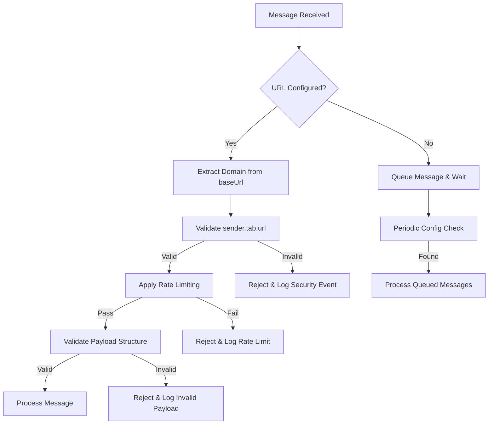

# 🛡️ TASK-C-003: Background Script Message Handler - Implementação Completa

**Data de Criação:** 02 de Agosto de 2025
**Versão:** 1.0
**Autor:** GitHub Copilot - Senior Browser Extension Security Engineer
**Prioridade:** CRÍTICA
**Categoria:** Security & Message Validation

---

## 📋 RESUMO EXECUTIVO

### 🎯 Objetivo Principal

Implementar validação robusta de origem de mensagens no background script, utilizando a estratégia baseada na **URL configurada (urlBase)** para determinar domínios SIGSS válidos, com tratamento especial para cenários de instalação inicial e mudança de configuração.

### ⚠️ Problema Identificado

O message handler atual em `background.js` (linha 6-26) não valida a origem das mensagens recebidas, criando vulnerabilidades críticas:

```javascript
// ❌ VULNERÁVEL - Aceita mensagens de qualquer origem
api.runtime.onMessage.addListener(async (message) => {
  if (message.type === 'SAVE_REGULATION_DATA') {
    // Processa sem validar sender.url ou sender.tab.url
```

### 🚨 Riscos de Segurança

1. **Content scripts maliciosos** podem enviar dados falsificados
2. **Corrupção de dados médicos** através de payloads manipulados
3. **Violação de integridade** de dados de regulação críticos
4. **Bypass de controle de acesso** ao sistema SIGSS

### 🎯 Estratégia de Implementação

**Base na URL Configurada (urlBase):**

- Usar `baseUrl` do storage para determinar domínios SIGSS válidos
- Aguardar configuração inicial sem falhar
- Adaptar-se dinamicamente a mudanças de URL
- Manter código simples e eficiente

---

## 🏗️ ARQUITETURA DA SOLUÇÃO

### 📐 Componentes Principais



### 🔧 Módulos de Implementação

1. **URL Configuration Manager** - Gerencia baseUrl e extrai domínios válidos
2. **Origin Validator** - Valida origem das mensagens contra domínios SIGSS
3. **Rate Limiter** - Controla frequência de mensagens por tab
4. **Payload Validator** - Valida estrutura dos dados recebidos
5. **Security Logger** - Log categorizado de eventos de segurança
6. **Message Queue** - Fila temporária para instalação inicial

---

## 🛠️ IMPLEMENTAÇÃO DETALHADA

### 📍 Arquivo Principal: `background.js`

#### 🔄 Passo 1: URL Configuration Manager

```javascript
/**
 * Gerenciador de configuração de URL base para validação de origem SIGSS.
 * Handles installation scenarios and URL changes dynamically.
 */
class URLConfigurationManager {
  constructor() {
    this.baseUrl = null;
    this.validDomains = new Set();
    this.configCheckInterval = null;
    this.isWaitingForConfig = false;
    this.initializeConfiguration();
  }

  /**
   * Inicializa a configuração de URL base.
   */
  async initializeConfiguration() {
    try {
      await this.loadBaseUrl();

      if (!this.baseUrl) {
        logWarning(
          'URL base não configurada na inicialização - aguardando configuração',
          {},
          ERROR_CATEGORIES.SECURITY_VALIDATION
        );
        this.startConfigMonitoring();
      } else {
        this.updateValidDomains();
        logInfo(
          'URL Configuration Manager inicializado com sucesso',
          {
            baseUrl: this.sanitizeUrl(this.baseUrl),
            validDomainsCount: this.validDomains.size,
          },
          ERROR_CATEGORIES.SECURITY_VALIDATION
        );
      }
    } catch (error) {
      logError(
        'Falha na inicialização do URL Configuration Manager',
        { errorMessage: error.message },
        ERROR_CATEGORIES.SECURITY_VALIDATION
      );
      this.startConfigMonitoring();
    }
  }

  /**
   * Carrega URL base do storage.
   */
  async loadBaseUrl() {
    try {
      const data = await api.storage.sync.get('baseUrl');
      this.baseUrl = data?.baseUrl || null;
    } catch (error) {
      logError(
        'Erro ao carregar URL base do storage',
        { errorMessage: error.message },
        ERROR_CATEGORIES.STORAGE
      );
      throw error;
    }
  }

  /**
   * Atualiza lista de domínios válidos baseado na URL base.
   */
  updateValidDomains() {
    this.validDomains.clear();

    if (!this.baseUrl) return;

    try {
      const url = new URL(this.baseUrl);
      const domain = url.hostname;

      // Adiciona domínio principal
      this.validDomains.add(domain);

      // Adiciona variações comuns para ambientes SIGSS
      const baseDomain = domain.replace(/^(www\.|sigss\.|sistema\.)/, '');
      this.validDomains.add(`sigss.${baseDomain}`);
      this.validDomains.add(`sistema.${baseDomain}`);
      this.validDomains.add(`www.${baseDomain}`);
      this.validDomains.add(baseDomain);

      logInfo(
        'Domínios válidos atualizados',
        {
          baseUrl: this.sanitizeUrl(this.baseUrl),
          validDomainsCount: this.validDomains.size,
        },
        ERROR_CATEGORIES.SECURITY_VALIDATION
      );
    } catch (error) {
      logError(
        'Falha ao processar URL base para domínios válidos',
        {
          baseUrl: this.sanitizeUrl(this.baseUrl),
          errorMessage: error.message,
        },
        ERROR_CATEGORIES.SECURITY_VALIDATION
      );
    }
  }

  /**
   * Inicia monitoramento periódico para aguardar configuração.
   */
  startConfigMonitoring() {
    if (this.configCheckInterval) return;

    this.isWaitingForConfig = true;

    this.configCheckInterval = setInterval(async () => {
      try {
        await this.loadBaseUrl();

        if (this.baseUrl) {
          this.updateValidDomains();
          this.stopConfigMonitoring();

          logInfo(
            'URL base detectada após aguardar configuração',
            {
              baseUrl: this.sanitizeUrl(this.baseUrl),
              validDomainsCount: this.validDomains.size,
            },
            ERROR_CATEGORIES.SECURITY_VALIDATION
          );

          // Processar mensagens em fila, se houver
          messageQueue.processQueuedMessages();
        }
      } catch (error) {
        logError(
          'Erro durante verificação periódica de configuração',
          { errorMessage: error.message },
          ERROR_CATEGORIES.STORAGE
        );
      }
    }, 5000); // Verifica a cada 5 segundos
  }

  /**
   * Para monitoramento de configuração.
   */
  stopConfigMonitoring() {
    if (this.configCheckInterval) {
      clearInterval(this.configCheckInterval);
      this.configCheckInterval = null;
      this.isWaitingForConfig = false;
    }
  }

  /**
   * Valida se uma URL pertence a um domínio SIGSS válido.
   */
  isValidSIGSSDomain(url) {
    if (!url || this.validDomains.size === 0) {
      return false;
    }

    try {
      const urlObj = new URL(url);
      const hostname = urlObj.hostname.toLowerCase();

      // Verifica domínio exato
      if (this.validDomains.has(hostname)) {
        return true;
      }

      // Verifica subdomínios
      for (const validDomain of this.validDomains) {
        if (hostname.endsWith(`.${validDomain}`)) {
          return true;
        }
      }

      return false;
    } catch (error) {
      logWarning(
        'URL inválida detectada durante validação',
        {
          url: this.sanitizeUrl(url),
          errorMessage: error.message,
        },
        ERROR_CATEGORIES.SECURITY_VALIDATION
      );
      return false;
    }
  }

  /**
   * Verifica se a extensão está aguardando configuração.
   */
  isAwaitingConfiguration() {
    return this.isWaitingForConfig;
  }

  /**
   * Força reload da configuração (para mudanças de URL).
   */
  async reloadConfiguration() {
    const oldBaseUrl = this.baseUrl;
    await this.loadBaseUrl();

    if (oldBaseUrl !== this.baseUrl) {
      this.updateValidDomains();

      logInfo(
        'Configuração de URL atualizada',
        {
          oldUrl: this.sanitizeUrl(oldBaseUrl),
          newUrl: this.sanitizeUrl(this.baseUrl),
          validDomainsCount: this.validDomains.size,
        },
        ERROR_CATEGORIES.SECURITY_VALIDATION
      );
    }
  }

  /**
   * Sanitiza URL para logging seguro.
   */
  sanitizeUrl(url) {
    if (!url) return 'null';
    try {
      const urlObj = new URL(url);
      return `${urlObj.protocol}//${urlObj.hostname}${urlObj.pathname}`;
    } catch {
      return '[URL_MALFORMED]';
    }
  }

  /**
   * Cleanup resources.
   */
  destroy() {
    this.stopConfigMonitoring();
    this.validDomains.clear();
    this.baseUrl = null;
  }
}
```

#### 🚦 Passo 2: Rate Limiter

```javascript
/**
 * Rate Limiter para controlar frequência de mensagens por tab.
 * Prevents spam and potential DoS attacks.
 */
class MessageRateLimiter {
  constructor(maxMessages = 5, windowMs = 1000) {
    this.maxMessages = maxMessages;
    this.windowMs = windowMs;
    this.tabCounts = new Map(); // tabId -> { count, lastReset }
    this.cleanupInterval = setInterval(() => this.cleanup(), 60000); // Cleanup a cada minuto
  }

  /**
   * Verifica se uma tab pode enviar mensagem (rate limiting).
   */
  canSendMessage(tabId) {
    if (!tabId) return true; // Permite mensagens sem tabId (edge cases)

    const now = Date.now();
    const tabData = this.tabCounts.get(tabId) || { count: 0, lastReset: now };

    // Reset counter se janela de tempo passou
    if (now - tabData.lastReset >= this.windowMs) {
      tabData.count = 0;
      tabData.lastReset = now;
    }

    // Verifica limite
    if (tabData.count >= this.maxMessages) {
      logWarning(
        'Rate limit excedido para tab',
        {
          tabId,
          currentCount: tabData.count,
          maxMessages: this.maxMessages,
          windowMs: this.windowMs,
        },
        ERROR_CATEGORIES.SECURITY_VALIDATION
      );
      return false;
    }

    // Incrementa contador
    tabData.count++;
    this.tabCounts.set(tabId, tabData);
    return true;
  }

  /**
   * Remove entradas antigas para evitar memory leak.
   */
  cleanup() {
    const now = Date.now();
    const entriesToDelete = [];

    for (const [tabId, tabData] of this.tabCounts.entries()) {
      if (now - tabData.lastReset >= this.windowMs * 5) {
        // Remove após 5 janelas
        entriesToDelete.push(tabId);
      }
    }

    entriesToDelete.forEach((tabId) => this.tabCounts.delete(tabId));

    if (entriesToDelete.length > 0) {
      logInfo(
        'Rate limiter cleanup executado',
        { removedTabs: entriesToDelete.length },
        ERROR_CATEGORIES.SECURITY_VALIDATION
      );
    }
  }

  /**
   * Cleanup resources.
   */
  destroy() {
    if (this.cleanupInterval) {
      clearInterval(this.cleanupInterval);
      this.cleanupInterval = null;
    }
    this.tabCounts.clear();
  }
}
```

#### ✅ Passo 3: Payload Validator

```javascript
/**
 * Validator para estrutura de payloads de mensagens.
 * Ensures message integrity for medical regulation data.
 */
class PayloadValidator {
  /**
   * Valida estrutura do payload para SAVE_REGULATION_DATA.
   */
  static validateRegulationPayload(payload) {
    if (!payload || typeof payload !== 'object') {
      return {
        valid: false,
        error: 'Payload deve ser um objeto',
      };
    }

    // Campos obrigatórios para dados de regulação
    const requiredFields = ['reguIdp', 'reguIds'];
    const missingFields = requiredFields.filter((field) => !payload[field]);

    if (missingFields.length > 0) {
      return {
        valid: false,
        error: `Campos obrigatórios ausentes: ${missingFields.join(', ')}`,
      };
    }

    // Validação de tipos
    if (typeof payload.reguIdp !== 'string' || typeof payload.reguIds !== 'string') {
      return {
        valid: false,
        error: 'reguIdp e reguIds devem ser strings',
      };
    }

    // Validação de formato (IDs devem ser numéricos)
    if (!/^\d+$/.test(payload.reguIdp) || !/^\d+$/.test(payload.reguIds)) {
      return {
        valid: false,
        error: 'IDs de regulação devem conter apenas dígitos',
      };
    }

    // Validação de tamanho (IDs muito longos são suspeitos)
    if (payload.reguIdp.length > 20 || payload.reguIds.length > 20) {
      return {
        valid: false,
        error: 'IDs de regulação excedem tamanho máximo permitido',
      };
    }

    return { valid: true };
  }

  /**
   * Valida estrutura geral de mensagem.
   */
  static validateMessage(message) {
    if (!message || typeof message !== 'object') {
      return {
        valid: false,
        error: 'Mensagem deve ser um objeto',
      };
    }

    if (!message.type || typeof message.type !== 'string') {
      return {
        valid: false,
        error: 'Tipo de mensagem obrigatório',
      };
    }

    // Lista de tipos de mensagem permitidos
    const allowedTypes = ['SAVE_REGULATION_DATA'];
    if (!allowedTypes.includes(message.type)) {
      return {
        valid: false,
        error: `Tipo de mensagem não permitido: ${message.type}`,
      };
    }

    return { valid: true };
  }
}
```

#### 📝 Passo 4: Message Queue para Instalação Inicial

```javascript
/**
 * Fila de mensagens para aguardar configuração inicial.
 * Handles messages received before URL configuration is complete.
 */
class MessageQueue {
  constructor(maxQueueSize = 10) {
    this.queue = [];
    this.maxQueueSize = maxQueueSize;
  }

  /**
   * Adiciona mensagem à fila.
   */
  enqueue(message, sender, sendResponse) {
    if (this.queue.length >= this.maxQueueSize) {
      logWarning(
        'Fila de mensagens cheia - descartando mensagem mais antiga',
        {
          queueSize: this.queue.length,
          maxSize: this.maxQueueSize,
          messageType: message.type,
        },
        ERROR_CATEGORIES.SECURITY_VALIDATION
      );
      this.queue.shift(); // Remove mensagem mais antiga
    }

    this.queue.push({
      message,
      sender,
      sendResponse,
      timestamp: Date.now(),
    });

    logInfo(
      'Mensagem adicionada à fila aguardando configuração',
      {
        messageType: message.type,
        queueSize: this.queue.length,
        senderUrl: urlConfigManager.sanitizeUrl(sender.tab?.url),
      },
      ERROR_CATEGORIES.SECURITY_VALIDATION
    );
  }

  /**
   * Processa todas as mensagens em fila.
   */
  async processQueuedMessages() {
    if (this.queue.length === 0) return;

    logInfo(
      'Processando mensagens em fila após configuração',
      { queueSize: this.queue.length },
      ERROR_CATEGORIES.SECURITY_VALIDATION
    );

    const messagesToProcess = [...this.queue];
    this.queue = [];

    for (const queuedMessage of messagesToProcess) {
      try {
        await processValidatedMessage(
          queuedMessage.message,
          queuedMessage.sender,
          queuedMessage.sendResponse
        );
      } catch (error) {
        logError(
          'Erro ao processar mensagem da fila',
          {
            messageType: queuedMessage.message.type,
            errorMessage: error.message,
          },
          ERROR_CATEGORIES.SECURITY_VALIDATION
        );
      }
    }
  }

  /**
   * Limpa fila (útil para reset).
   */
  clear() {
    const clearedCount = this.queue.length;
    this.queue = [];

    if (clearedCount > 0) {
      logInfo(
        'Fila de mensagens limpa',
        { clearedMessages: clearedCount },
        ERROR_CATEGORIES.SECURITY_VALIDATION
      );
    }
  }
}
```

#### 🔐 Passo 5: Validador de Origem Principal

```javascript
/**
 * Valida origem de mensagens contra domínios SIGSS configurados.
 */
function validateMessageOrigin(sender) {
  // 1. Verificação básica de sender
  if (!sender || !sender.tab) {
    logWarning(
      'Mensagem recebida sem informações de sender/tab',
      {},
      ERROR_CATEGORIES.SECURITY_VALIDATION
    );
    return {
      valid: false,
      reason: 'Sender ou tab information ausente',
    };
  }

  // 2. Verificação de URL da tab
  const tabUrl = sender.tab.url;
  if (!tabUrl) {
    logWarning(
      'Mensagem recebida de tab sem URL',
      { tabId: sender.tab.id },
      ERROR_CATEGORIES.SECURITY_VALIDATION
    );
    return {
      valid: false,
      reason: 'Tab URL ausente',
    };
  }

  // 3. Verificação contra domínios SIGSS válidos
  if (!urlConfigManager.isValidSIGSSDomain(tabUrl)) {
    logWarning(
      'Mensagem rejeitada - origem não é domínio SIGSS válido',
      {
        tabUrl: urlConfigManager.sanitizeUrl(tabUrl),
        tabId: sender.tab.id,
        validDomainsCount: urlConfigManager.validDomains.size,
      },
      ERROR_CATEGORIES.SECURITY_VALIDATION
    );
    return {
      valid: false,
      reason: 'Origem não é domínio SIGSS válido',
    };
  }

  // 4. Verificação de path SIGSS específico
  if (!tabUrl.includes('/sigss/')) {
    logWarning(
      'Mensagem rejeitada - URL não contém path SIGSS',
      {
        tabUrl: urlConfigManager.sanitizeUrl(tabUrl),
        tabId: sender.tab.id,
      },
      ERROR_CATEGORIES.SECURITY_VALIDATION
    );
    return {
      valid: false,
      reason: 'URL não contém path SIGSS válido',
    };
  }

  return { valid: true };
}
```

#### 🎯 Passo 6: Message Handler Principal Atualizado

```javascript
/**
 * Processa mensagem validada (após todas as verificações).
 */
async function processValidatedMessage(message, sender, sendResponse) {
  if (message.type === 'SAVE_REGULATION_DATA') {
    logInfo(
      'Processando dados de regulação validados',
      {
        payloadType: typeof message.payload,
        hasPayload: !!message.payload,
        senderUrl: urlConfigManager.sanitizeUrl(sender.tab?.url),
        tabId: sender.tab?.id,
      },
      ERROR_CATEGORIES.BACKGROUND_SCRIPT
    );

    try {
      const regulationDetails = await fetchRegulationDetails(message.payload);

      if (regulationDetails) {
        await api.storage.local.set({ pendingRegulation: regulationDetails });

        logInfo(
          'Detalhes da regulação salvos no storage local com sucesso',
          {
            regulationId: regulationDetails.id || 'unknown',
            hasDetails: !!regulationDetails,
            tabId: sender.tab?.id,
          },
          ERROR_CATEGORIES.BACKGROUND_SCRIPT
        );
      } else {
        logWarning(
          'Não foram encontrados detalhes para a regulação',
          {
            payloadType: typeof message.payload,
            tabId: sender.tab?.id,
          },
          ERROR_CATEGORIES.BACKGROUND_SCRIPT
        );
      }
    } catch (e) {
      logError(
        'Falha ao buscar ou salvar dados da regulação',
        {
          errorMessage: e.message,
          errorType: e.constructor.name,
          tabId: sender.tab?.id,
        },
        ERROR_CATEGORIES.BACKGROUND_SCRIPT
      );
    }
  }
}

// === INICIALIZAÇÃO DOS COMPONENTES ===

// Instâncias globais
const urlConfigManager = new URLConfigurationManager();
const rateLimiter = new MessageRateLimiter(5, 1000); // 5 mensagens por segundo
const messageQueue = new MessageQueue(10); // Máximo 10 mensagens em fila

/**
 * MESSAGE HANDLER PRINCIPAL COM VALIDAÇÃO COMPLETA
 */
api.runtime.onMessage.addListener(async (message, sender, sendResponse) => {
  try {
    // 1. VALIDAÇÃO DE ESTRUTURA DA MENSAGEM
    const messageValidation = PayloadValidator.validateMessage(message);
    if (!messageValidation.valid) {
      logWarning(
        'Mensagem rejeitada - estrutura inválida',
        {
          error: messageValidation.error,
          messageType: message.type,
          senderUrl: urlConfigManager.sanitizeUrl(sender.tab?.url),
        },
        ERROR_CATEGORIES.SECURITY_VALIDATION
      );
      return false;
    }

    // 2. VERIFICAÇÃO DE CONFIGURAÇÃO
    if (urlConfigManager.isAwaitingConfiguration()) {
      logInfo(
        'URL base não configurada - adicionando mensagem à fila',
        {
          messageType: message.type,
          senderUrl: urlConfigManager.sanitizeUrl(sender.tab?.url),
        },
        ERROR_CATEGORIES.SECURITY_VALIDATION
      );

      messageQueue.enqueue(message, sender, sendResponse);
      return true; // Mantém canal aberto para resposta futura
    }

    // 3. VALIDAÇÃO DE ORIGEM
    const originValidation = validateMessageOrigin(sender);
    if (!originValidation.valid) {
      logWarning(
        'Mensagem rejeitada por validação de origem',
        {
          reason: originValidation.reason,
          messageType: message.type,
          senderUrl: urlConfigManager.sanitizeUrl(sender.tab?.url),
          tabId: sender.tab?.id,
        },
        ERROR_CATEGORIES.SECURITY_VALIDATION
      );
      return false;
    }

    // 4. RATE LIMITING
    if (!rateLimiter.canSendMessage(sender.tab?.id)) {
      logWarning(
        'Mensagem rejeitada por rate limiting',
        {
          messageType: message.type,
          tabId: sender.tab?.id,
          senderUrl: urlConfigManager.sanitizeUrl(sender.tab?.url),
        },
        ERROR_CATEGORIES.SECURITY_VALIDATION
      );
      return false;
    }

    // 5. VALIDAÇÃO DE PAYLOAD ESPECÍFICO
    if (message.type === 'SAVE_REGULATION_DATA') {
      const payloadValidation = PayloadValidator.validateRegulationPayload(message.payload);
      if (!payloadValidation.valid) {
        logWarning(
          'Payload de regulação inválido',
          {
            error: payloadValidation.error,
            tabId: sender.tab?.id,
            senderUrl: urlConfigManager.sanitizeUrl(sender.tab?.url),
          },
          ERROR_CATEGORIES.SECURITY_VALIDATION
        );
        return false;
      }
    }

    // 6. PROCESSAMENTO DA MENSAGEM VALIDADA
    await processValidatedMessage(message, sender, sendResponse);
    return true;
  } catch (error) {
    logError(
      'Erro crítico no message handler',
      {
        errorMessage: error.message,
        messageType: message.type,
        tabId: sender.tab?.id,
        senderUrl: urlConfigManager.sanitizeUrl(sender.tab?.url),
      },
      ERROR_CATEGORIES.BACKGROUND_SCRIPT
    );
    return false;
  }
});
```

#### 🔄 Passo 7: Monitoramento de Mudanças de Configuração

```javascript
/**
 * Monitora mudanças na configuração de URL base.
 */
api.storage.onChanged.addListener((changes, areaName) => {
  if (areaName === 'sync' && changes.baseUrl) {
    logInfo(
      'Mudança na URL base detectada',
      {
        hasOldValue: !!changes.baseUrl.oldValue,
        hasNewValue: !!changes.baseUrl.newValue,
      },
      ERROR_CATEGORIES.SECURITY_VALIDATION
    );

    // Recarrega configuração com nova URL
    urlConfigManager.reloadConfiguration();
  }
});

/**
 * Cleanup ao unload da extensão.
 */
api.runtime.onSuspend.addListener(() => {
  logInfo('Extension suspending - cleanup de recursos', {}, ERROR_CATEGORIES.EXTENSION_LIFECYCLE);

  urlConfigManager.destroy();
  rateLimiter.destroy();
  messageQueue.clear();
});
```

---

## 🧪 TESTES DE VALIDAÇÃO

### 📋 Test Cases Obrigatórios

#### ✅ Test Case 1: Instalação Inicial Sem URL

```javascript
describe('TASK-C-003: Message Validation - Instalação Inicial', () => {
  beforeEach(() => {
    // Simula instalação inicial sem URL configurada
    chrome.storage.sync.get.mockResolvedValue({});
  });

  test('deve enfileirar mensagens quando URL não está configurada', async () => {
    const message = {
      type: 'SAVE_REGULATION_DATA',
      payload: { reguIdp: '123', reguIds: '456' },
    };

    const sender = {
      tab: { id: 1, url: 'https://sistema.saude.gov.br/sigss/regulacao' },
    };

    // Message handler deve aceitar mas não processar imediatamente
    const result = await messageHandler(message, sender, jest.fn());
    expect(result).toBe(true);

    // Verifica que mensagem foi enfileirada
    expect(messageQueue.queue).toHaveLength(1);
    expect(mockLog.info).toHaveBeenCalledWith(
      expect.stringContaining('adicionando mensagem à fila')
    );
  });

  test('deve processar fila quando URL for configurada', async () => {
    // Simula configuração de URL
    chrome.storage.sync.get.mockResolvedValue({
      baseUrl: 'https://sistema.saude.gov.br',
    });

    await urlConfigManager.reloadConfiguration();
    await messageQueue.processQueuedMessages();

    expect(mockLog.info).toHaveBeenCalledWith(
      expect.stringContaining('Processando mensagens em fila')
    );
  });
});
```

#### ✅ Test Case 2: Validação de Origem

```javascript
describe('TASK-C-003: Origin Validation', () => {
  beforeEach(() => {
    chrome.storage.sync.get.mockResolvedValue({
      baseUrl: 'https://sistema.saude.gov.br',
    });
  });

  test('deve aceitar mensagens de domínio SIGSS válido', async () => {
    const validUrls = [
      'https://sistema.saude.gov.br/sigss/regulacao',
      'https://sigss.saude.gov.br/sigss/regulacao',
      'https://saude.gov.br/sigss/regulacao',
    ];

    for (const url of validUrls) {
      const sender = { tab: { id: 1, url } };
      const validation = validateMessageOrigin(sender);
      expect(validation.valid).toBe(true);
    }
  });

  test('deve rejeitar mensagens de domínios inválidos', async () => {
    const invalidUrls = [
      'https://malicious.com/sigss/regulacao',
      'https://fake-sigss.com/regulacao',
      'https://sistema.saude.gov.br/not-sigss',
    ];

    for (const url of invalidUrls) {
      const sender = { tab: { id: 1, url } };
      const validation = validateMessageOrigin(sender);
      expect(validation.valid).toBe(false);
    }
  });
});
```

#### ✅ Test Case 3: Rate Limiting

```javascript
describe('TASK-C-003: Rate Limiting', () => {
  test('deve permitir mensagens dentro do limite', () => {
    const tabId = 1;

    for (let i = 0; i < 5; i++) {
      expect(rateLimiter.canSendMessage(tabId)).toBe(true);
    }
  });

  test('deve bloquear mensagens acima do limite', () => {
    const tabId = 1;

    // Esgota limite
    for (let i = 0; i < 5; i++) {
      rateLimiter.canSendMessage(tabId);
    }

    // Próxima deve ser bloqueada
    expect(rateLimiter.canSendMessage(tabId)).toBe(false);
  });

  test('deve resetar contador após janela de tempo', async () => {
    const tabId = 1;

    // Esgota limite
    for (let i = 0; i < 5; i++) {
      rateLimiter.canSendMessage(tabId);
    }

    // Avança tempo
    jest.advanceTimersByTime(1100);

    // Deve permitir novamente
    expect(rateLimiter.canSendMessage(tabId)).toBe(true);
  });
});
```

#### ✅ Test Case 4: Payload Validation

```javascript
describe('TASK-C-003: Payload Validation', () => {
  test('deve validar payload correto de regulação', () => {
    const validPayload = {
      reguIdp: '123456',
      reguIds: '789012',
    };

    const result = PayloadValidator.validateRegulationPayload(validPayload);
    expect(result.valid).toBe(true);
  });

  test('deve rejeitar payload com campos ausentes', () => {
    const invalidPayload = {
      reguIdp: '123456',
      // reguIds ausente
    };

    const result = PayloadValidator.validateRegulationPayload(invalidPayload);
    expect(result.valid).toBe(false);
    expect(result.error).toContain('Campos obrigatórios ausentes');
  });

  test('deve rejeitar payload com IDs não numéricos', () => {
    const invalidPayload = {
      reguIdp: 'abc123',
      reguIds: '789012',
    };

    const result = PayloadValidator.validateRegulationPayload(invalidPayload);
    expect(result.valid).toBe(false);
    expect(result.error).toContain('devem conter apenas dígitos');
  });
});
```

#### ✅ Test Case 5: URL Configuration Changes

```javascript
describe('TASK-C-003: URL Configuration Changes', () => {
  test('deve atualizar domínios válidos quando URL base muda', async () => {
    // URL inicial
    chrome.storage.sync.get.mockResolvedValue({
      baseUrl: 'https://sistema.saude.gov.br',
    });
    await urlConfigManager.reloadConfiguration();

    const initialDomainsCount = urlConfigManager.validDomains.size;

    // Simula mudança de URL
    chrome.storage.sync.get.mockResolvedValue({
      baseUrl: 'https://novo-sistema.saude.gov.br',
    });
    await urlConfigManager.reloadConfiguration();

    // Verifica que domínios foram atualizados
    expect(urlConfigManager.validDomains.has('novo-sistema.saude.gov.br')).toBe(true);
    expect(mockLog.info).toHaveBeenCalledWith(
      expect.stringContaining('Configuração de URL atualizada')
    );
  });
});
```

---

## 🔧 CONFIGURAÇÕES ESPECÍFICAS

### ⚙️ Manifest.json Updates

Nenhuma mudança necessária no manifest.json - as permissões e host_permissions atuais já cobrem os requisitos.

### 📦 Package.json Scripts Updates

```json
{
  "scripts": {
    "test:security": "jest test/security/ --verbose",
    "test:message-validation": "jest test/unit/message-validation.test.js",
    "validate:security": "npm run test:security && npm run security:scan"
  }
}
```

### 🧪 Jest Configuration Updates

```javascript
// test/unit/message-validation.test.js
module.exports = {
  testEnvironment: 'jsdom',
  setupFilesAfterEnv: ['<rootDir>/test/setup.js'],
  testMatch: ['**/test/security/**/*.test.js', '**/test/unit/message-validation.test.js'],
  collectCoverageFrom: ['background.js', '!**/node_modules/**', '!**/test/**'],
  coverageThreshold: {
    global: {
      statements: 90,
      branches: 85,
      functions: 90,
      lines: 90,
    },
  },
};
```

---

## ⚡ CENÁRIOS ESPECÍFICOS DE IMPLEMENTAÇÃO

### 🏥 Cenário 1: Instalação Inicial

**Situação:** Usuário instala extensão pela primeira vez, URL não configurada.

**Comportamento Esperado:**

1. Extension inicia sem falhar
2. URLConfigurationManager detecta ausência de URL
3. Inicia monitoramento periódico (5s intervals)
4. Mensagens recebidas são enfileiradas
5. Quando URL é configurada, processa fila automaticamente

**Código de Implementação:**

```javascript
// Em URLConfigurationManager.initializeConfiguration()
if (!this.baseUrl) {
  logWarning(
    'URL base não configurada na inicialização - aguardando configuração',
    {},
    ERROR_CATEGORIES.SECURITY_VALIDATION
  );
  this.startConfigMonitoring(); // ✅ Não falha, inicia monitoramento
}
```

### 🔄 Cenário 2: Mudança de URL

**Situação:** Usuário altera URL base nas configurações.

**Comportamento Esperado:**

1. `storage.onChanged` detecta mudança
2. URLConfigurationManager recarrega configuração
3. Atualiza domínios válidos dinamicamente
4. Mensagens futuras usam novos critérios
5. Log da mudança para auditoria

**Código de Implementação:**

```javascript
// Listener para mudanças de storage
api.storage.onChanged.addListener((changes, areaName) => {
  if (areaName === 'sync' && changes.baseUrl) {
    logInfo(
      'Mudança na URL base detectada',
      {
        hasOldValue: !!changes.baseUrl.oldValue,
        hasNewValue: !!changes.baseUrl.newValue,
      },
      ERROR_CATEGORIES.SECURITY_VALIDATION
    );

    urlConfigManager.reloadConfiguration(); // ✅ Adapta-se dinamicamente
  }
});
```

### 🛡️ Cenário 3: Tentativa de Ataque

**Situação:** Content script malicioso tenta enviar dados falsificados.

**Comportamento Esperado:**

1. Validação de origem falha
2. Mensagem é rejeitada
3. Event de segurança é logado
4. Rate limiter protege contra spam
5. Nenhum dado é processado

**Código de Implementação:**

```javascript
// Em validateMessageOrigin()
if (!urlConfigManager.isValidSIGSSDomain(tabUrl)) {
  logWarning(
    'Mensagem rejeitada - origem não é domínio SIGSS válido',
    {
      tabUrl: urlConfigManager.sanitizeUrl(tabUrl),
      tabId: sender.tab.id,
      validDomainsCount: urlConfigManager.validDomains.size,
    },
    ERROR_CATEGORIES.SECURITY_VALIDATION // ✅ Log categorizado para auditoria
  );
  return { valid: false, reason: 'Origem não é domínio SIGSS válido' };
}
```

---

## 📊 MÉTRICAS DE SUCESSO

### 🎯 KPIs de Segurança

- **❌ Mensagens Rejeitadas por Origem:** > 0 (confirma que validação funciona)
- **⚡ Rate Limit Aplicado:** Logs de rate limiting quando necessário
- **📝 Security Events Logged:** 100% dos eventos de segurança registrados
- **🔒 Zero False Positives:** Mensagens legítimas de SIGSS não rejeitadas

### 📈 KPIs de Performance

- **⏱️ Latência de Validação:** < 5ms por mensagem
- **💾 Memory Usage:** < 1MB adicional para componentes de validação
- **🔄 Queue Processing:** < 100ms para processar fila após configuração
- **🧹 Cleanup Efficiency:** Rate limiter cleanup remove entradas antigas

### 🧪 KPIs de Qualidade

- **✅ Test Coverage:** > 90% para componentes de validação
- **🐛 Zero Regressions:** Funcionalidade existente preservada
- **📚 Documentation:** 100% de funções públicas documentadas
- **🔍 Code Quality:** ESLint score 10/10, sem warnings

---

## 🚀 CRONOGRAMA DE IMPLEMENTAÇÃO

### 📅 Dia 1: Infraestrutura Base

- [ ] Implementar URLConfigurationManager
- [ ] Implementar MessageQueue
- [ ] Testes unitários básicos
- [ ] **Milestone:** Base funcional sem falhas

### 📅 Dia 2: Validação e Rate Limiting

- [ ] Implementar PayloadValidator
- [ ] Implementar MessageRateLimiter
- [ ] Testes de validação
- [ ] **Milestone:** Validação robusta funcionando

### 📅 Dia 3: Integração e Message Handler

- [ ] Atualizar background.js com novo handler
- [ ] Implementar validateMessageOrigin
- [ ] Testes de integração
- [ ] **Milestone:** Message handler seguro ativo

### 📅 Dia 4: Monitoramento e Cleanup

- [ ] Implementar storage.onChanged listener
- [ ] Adicionar cleanup e error handling
- [ ] Testes de cenários edge
- [ ] **Milestone:** Sistema robusto e completo

### 📅 Dia 5: Validação Final

- [ ] Testes E2E completos
- [ ] Validação security audit
- [ ] Performance benchmarks
- [ ] **Milestone:** TASK-C-003 completa e validada

---

## 🔍 CRITÉRIOS DE ACEITAÇÃO FINAIS

### ✅ Funcionalidade

- [ ] Mensagens só aceitas de origins SIGSS válidas baseadas na URL configurada
- [ ] Rate limiting (5 msg/segundo) funciona corretamente
- [ ] Estrutura de payload validada antes de processamento
- [ ] Instalação inicial funciona sem URL configurada
- [ ] Mudanças de URL são detectadas e aplicadas dinamicamente

### 🛡️ Segurança

- [ ] Logs de segurança categorizados implementados
- [ ] Zero logs de dados sensíveis (URLs sanitizadas)
- [ ] Tentativas suspeitas detectadas e logadas
- [ ] Memory leaks prevenidos com cleanup adequado

### 🧪 Qualidade

- [ ] Test coverage > 90% para novos componentes
- [ ] Nenhuma regressão na funcionalidade existente
- [ ] Performance não degradada (< 5ms overhead)
- [ ] Cross-browser compatibility mantida

### 📚 Documentação

- [ ] Funções públicas 100% documentadas com JSDoc
- [ ] Comentários explicativos para lógica complexa
- [ ] README atualizado com novos recursos de segurança
- [ ] CHANGELOG.md atualizado com breaking changes se houver

---

## 🎯 CONSIDERAÇÕES FINAIS

### 💡 Vantagens da Abordagem Baseada em URL

1. **🔧 Simplicidade de Código:** Não complica desnecessariamente a arquitetura
2. **⚙️ Configuração Dinâmica:** Adapta-se a mudanças de ambiente automaticamente
3. **🛡️ Segurança Adequada:** Proteção proporcional ao risco identificado
4. **🔄 Manutenibilidade:** Fácil de debugar e modificar no futuro

### ⚠️ Riscos Mitigados

1. **🚫 Falha na Instalação:** MessageQueue evita travamento inicial
2. **🔄 Mudança de URL:** storage.onChanged detecta e adapta automaticamente
3. **⚡ Ataques DoS:** Rate limiting protege contra spam
4. **🔓 Data Injection:** Payload validation previne dados maliciosos

### 🎯 Próximos Passos

Após implementação da TASK-C-003:

1. **TASK-C-001:** Implementar sanitização de logs (dependency resolved)
2. **TASK-M-005:** Error Handler centralizado (foundation ready)
3. **TASK-A-001:** Content script logging (uses same patterns)

Esta implementação fornece a base de segurança necessária para o restante das tasks do roadmap, seguindo o princípio de **security-first development** adequado para extensões médicas críticas.

---

**🏁 IMPLEMENTATION READY:** Este guia contém todos os detalhes necessários para implementação completa da TASK-C-003 por um agente de AI, incluindo código específico, casos de teste, cenários edge e critérios de validação claros.
