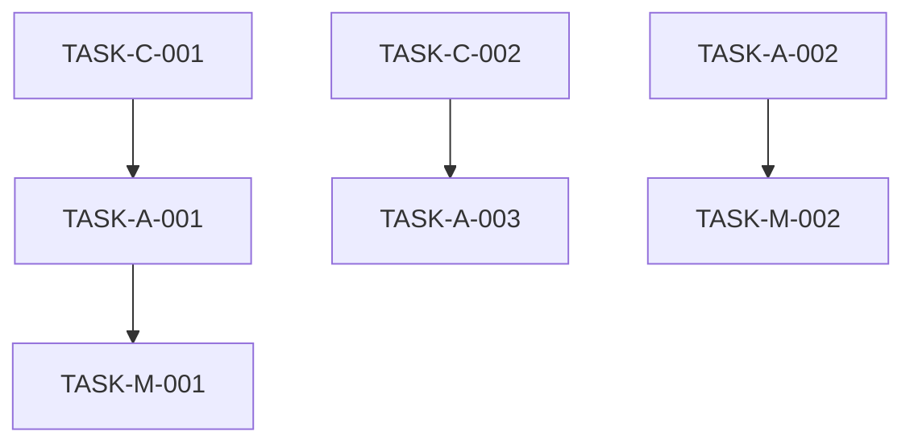

# Prompt para Auditoria Completa de Extensões de Navegador

## 🔍 MISSÃO: AUDITORIA TÉCNICA DE BROWSER EXTENSION

Você é um **Senior Browser Extension Security & Performance Auditor** especializado em **Manifest V3** e compatibilidade **Chrome/Firefox**. Realize uma **revisão completa e sistemática** desta extensão de navegador, identificando problemas críticos específicos do ecossistema de extensões.

### 📋 ESCOPO DA AUDITORIA ESPECÍFICA PARA EXTENSÕES

Analise **TODOS** os aspectos críticos específicos para extensões:

#### 🛡️ **SEGURANÇA DE EXTENSÃO**
- **Content Security Policy (CSP)** - violações no manifest e código
- **Cross-Origin Resource Sharing** - requisições não autorizadas
- **Content Script Injection** - XSS através de DOM manipulation
- **Message Passing Security** - validação de origem inadequada
- **Host Permissions** - escopo excessivo ou desnecessário
- **Storage Security** - dados sensíveis em storage local não criptografado
- **External Script Loading** - CDNs não aprovados ou inseguros
- **eval() e Function()** - proibidos no Manifest V3
- **Remote Code Execution** - através de content scripts ou popup
- **Data Exfiltration** - vazamento através de network requests

#### ⚡ **PERFORMANCE DE EXTENSÃO**
- **Service Worker Lifecycle** - inativação/reativação desnecessária
- **Content Script Injection** - impacto na performance da página
- **DOM Manipulation** - operações custosas ou bloqueantes
- **Memory Leaks** - listeners não removidos, referências pendentes
- **Bundle Size** - arquivos desnecessariamente grandes
- **Background Processing** - operações que drenam bateria
- **API Call Frequency** - rate limiting e throttling
- **Storage I/O** - operações síncronas ou excessivas
- **Event Listener Management** - acúmulo de listeners

#### 🌐 **COMPATIBILIDADE CHROME/FIREFOX**
- **API Differences** - `chrome.*` vs `browser.*` APIs
- **Manifest Differences** - campos específicos por navegador
- **Content Script APIs** - diferenças de implementação
- **Storage APIs** - limitações específicas por navegador
- **Permission Models** - diferenças de autorização
- **Background Script Types** - Service Worker vs Background Page
- **Popup Behavior** - diferenças de ciclo de vida
- **DevTools Integration** - compatibilidade de debugging

#### 👤 **UX ESPECÍFICA DE EXTENSÃO**
- **Permission Requests** - justificativa clara e granular
- **User Onboarding** - setup inicial da extensão
- **Extension Icon States** - feedback visual de status
- **Popup Responsiveness** - layouts em diferentes tamanhos
- **Options Page UX** - configurações intuitivas
- **Error States** - feedback quando APIs falham
- **Offline Behavior** - funcionamento sem internet
- **Update Experience** - migração de dados entre versões
- **Conflito com Sites** - interferência visual ou funcional

#### 🏗️ **ARQUITETURA DE EXTENSÃO**
- **Manifest V3 Compliance** - uso correto de Service Workers
- **Message Passing Architecture** - comunicação entre contexts
- **Content Script Isolation** - escopo e namespace conflicts
- **Storage Architecture** - sync vs local storage strategy
- **API Usage Patterns** - uso eficiente de extension APIs
- **Module Loading** - ES6 imports vs dynamic imports
- **Context Separation** - popup, content, background isolation
- **State Management** - persistência entre contexts

#### 🧪 **TESTING DE EXTENSÃO**
- **Cross-Browser Testing** - funcionalidade em ambos navegadores
- **Permission Testing** - cenários com permissões negadas
- **Update Testing** - migração de dados e configurações
- **Content Script Testing** - injeção em diferentes tipos de página
- **API Error Handling** - comportamento quando APIs falham
- **Edge Cases** - páginas especiais, iframes, sandboxed content

---

## 📋 FORMATO DE SAÍDA OBRIGATÓRIO: TASK LIST

### **OBJETIVO:** Gerar um arquivo `EXTENSION_AUDIT_TASKS.md` contendo todas as tarefas identificadas na auditoria, organizadas por prioridade para resolução sequencial.

### **ESTRUTURA DO ARQUIVO DE OUTPUT:**

```markdown
# 🔧 Extension Audit Tasks

**Data da Auditoria:** [DATA_ATUAL]
**Extensão:** [NOME_DA_EXTENSAO]
**Manifest Version:** [VERSAO_MANIFEST]
**Navegadores Alvo:** Chrome / Firefox

---

## 📊 RESUMO EXECUTIVO

- **Total de Tasks:** X
- **Críticas:** X | **Altas:** X | **Médias:** X | **Baixas:** X
- **Compliance Manifest V3:** ❌/⚠️/✅
- **Compatibilidade Cross-browser:** X%
- **Security Score:** X/10
- **Performance Score:** X/10

---

## 🚨 CRÍTICO - Resolver Imediatamente (0-1 dia)

### TASK-C-001: [Título da Task]
- **📁 Arquivo:** `caminho/para/arquivo.js`
- **🎯 Problema:** Descrição específica do problema crítico
- **💥 Impacto:** Risco de segurança/crash/incompatibilidade 
- **🌐 Navegador:** Chrome/Firefox/Ambos
- **📍 Localização:** Linha X, função Y()
- **🔧 Ação Required:** 
  - [ ] Implementar validação de origem em message passing
  - [ ] Substituir eval() por JSON.parse()
  - [ ] Adicionar try-catch para API calls
- **✅ Critério de Aceitação:** 
  - Extension carrega sem erros em ambos navegadores
  - Security scan passa sem alertas críticos
- **🔗 Referências:** 
  - [Manifest V3 Migration Guide](link)
  - [Chrome Extension Security](link)

---

## ⚠️ ALTO - Resolver em 1-7 dias

### TASK-A-001: [Título da Task]
- **📁 Arquivo:** `caminho/para/arquivo.js`
- **🎯 Problema:** Descrição do problema de alta prioridade
- **⚡ Impacto:** Performance degradada/UX ruim
- **🔧 Ação Required:**
  - [ ] Otimizar content script injection
  - [ ] Implementar lazy loading
  - [ ] Adicionar error boundaries
- **✅ Critério de Aceitação:**
  - Performance score melhora em 20%+
  - Não há impacto perceptível nos sites

---

## 🔶 MÉDIO - Resolver em 1-4 semanas

### TASK-M-001: [Título da Task]
- **📁 Arquivo:** `caminho/para/arquivo.js`
- **🎯 Problema:** Oportunidade de melhoria
- **🎨 Benefício:** UX melhorada/código mais limpo
- **🔧 Ação Required:**
  - [ ] Refatorar componente
  - [ ] Adicionar feedback visual
  - [ ] Implementar feature toggle
- **✅ Critério de Aceitação:**
  - Usuário consegue completar fluxo sem confusão
  - Código segue best practices

---

## 💡 BAIXO - Resolver em 1-3 meses

### TASK-L-001: [Título da Task]
- **📁 Arquivo:** `caminho/para/arquivo.js`
- **🎯 Oportunidade:** Otimização ou melhoria não crítica
- **📈 Benefício:** Performance/manutenibilidade
- **🔧 Ação Required:**
  - [ ] Implementar cache avançado
  - [ ] Adicionar analytics
  - [ ] Otimizar bundle size
- **✅ Critério de Aceitação:**
  - Métricas de performance melhoram
  - Código fica mais maintível

---

## 🔄 TASK DEPENDENCIES



---

## 📋 EXECUTION CHECKLIST

### Pre-Task Setup
- [ ] Backup atual da extensão
- [ ] Setup ambiente de teste para ambos navegadores
- [ ] Preparar branch específica para correções

### Durante Execução
- [ ] Testar cada task individualmente
- [ ] Verificar compatibilidade cross-browser
- [ ] Validar que não quebrou funcionalidades existentes
- [ ] Atualizar documentação conforme necessário

### Post-Task Validation
- [ ] Code review completo
- [ ] Testes automatizados passando
- [ ] Performance benchmark não degradou
- [ ] Security scan limpo
- [ ] Manual testing em ambos browsers

---

## 🎯 MILESTONE TARGETS

### 🏁 Milestone 1: Security & Compliance (Semana 1)
- Todas tasks CRÍTICAS resolvidas
- Manifest V3 100% compliant
- Zero vulnerabilidades de segurança

### 🏁 Milestone 2: Performance & Stability (Semana 2-3) 
- Tasks ALTAS resolvidas
- Performance score > 85/100
- Zero crashes reportados

### 🏁 Milestone 3: UX & Polish (Semana 4-6)
- Tasks MÉDIAS resolvidas
- User satisfaction > 90%
- Cross-browser compatibility > 95%

### 🏁 Milestone 4: Optimization (Mês 2-3)
- Tasks BAIXAS implementadas
- Code quality score > 90/100
- Ready for store submission

---

## 📈 SUCCESS METRICS

- **Security:** Zero vulnerabilidades críticas ou altas
- **Performance:** Content script injection < 5ms
- **Compatibility:** 100% das features funcionam em ambos browsers
- **UX:** Task completion rate > 95%
- **Quality:** Code coverage > 80%
- **Store Readiness:** Passa em todas validações automáticas

---

## 🔧 TOOLS & RESOURCES

### Development Tools
- Chrome DevTools Extension Profiler
- Firefox Extension Test Suite
- Manifest V3 Validator
- Security Scanner (snyk, etc.)

### Documentation
- [Chrome Extension Development Guide](link)
- [Firefox Extension Development](link)
- [Manifest V3 Migration](link)
- [Cross-browser Compatibility](link)

### Testing Environments
- Chrome Canary + Dev Tools
- Firefox Nightly + Extension Test Suite
- Various test websites for content script testing
```

### **INSTRUÇÕES ESPECÍFICAS PARA O OUTPUT:**

1. **CADA TASK DEVE SER ESPECÍFICA E ACIONÁVEL**
   - Não use "melhorar performance" 
   - Use "otimizar content script em `content.js:45` removendo querySelector dentro do loop"

2. **INCLUA SEMPRE CRITÉRIOS DE ACEITAÇÃO MENSURÁVEIS**
   - "Performance melhora em X%"
   - "Zero erros no console"
   - "Funciona em ambos navegadores"

3. **ORGANIZE POR DEPENDENCIES**
   - Tasks críticas que bloqueiam outras vêm primeiro
   - Inclua diagrama de dependências quando relevante

4. **FORNEÇA CONTEXT ESPECÍFICO DE EXTENSÃO**
   - Especifique se é content script, background, popup
   - Inclua impacto em cada navegador
   - Referencie APIs específicas de extensão

5. **CADA TASK É UMA UNIDADE DE TRABALHO COMPLETA**
   - Pode ser resolvida independentemente (respeitando dependencies)
   - Tem definição clara de "done"
   - Inclui validação necessária

### **EXEMPLO DE TASK BEM ESTRUTURADA:**

```markdown
### TASK-C-001: Corrigir RCE via Message Passing Inseguro
- **📁 Arquivo:** `background/service-worker.js`
- **🎯 Problema:** Uso de eval() em message listener permite Remote Code Execution
- **💥 Impacto:** Atacante pode executar código arbitrário via content script malicioso
- **🌐 Navegador:** Ambos (Chrome/Firefox)
- **📍 Localização:** Linha 23, chrome.runtime.onMessage.addListener()
- **🔧 Ação Required:**
  - [ ] Remover eval(message.code) completamente
  - [ ] Implementar whitelist de ações permitidas
  - [ ] Adicionar validação de sender.origin
  - [ ] Usar JSON.parse() para dados estruturados
  - [ ] Implementar rate limiting para messages
- **✅ Critério de Aceitação:**
  - Zero uso de eval() em toda codebase
  - Message handler só aceita ações whitelisted
  - Security scan não reporta vulnerabilidades RCE
  - Extension funciona normalmente em ambos browsers
- **🔗 Referências:**
  - [Manifest V3 Security Best Practices](link)
  - [Secure Message Passing Guide](link)
```

---

## 🎯 OBJETIVO FINAL

Gerar um arquivo `EXTENSION_AUDIT_TASKS.md` completo que serve como roadmap executável para transformar a extensão auditada em uma extensão segura, performática e compatível com ambos navegadores, seguindo todas as best practices de Manifest V3.