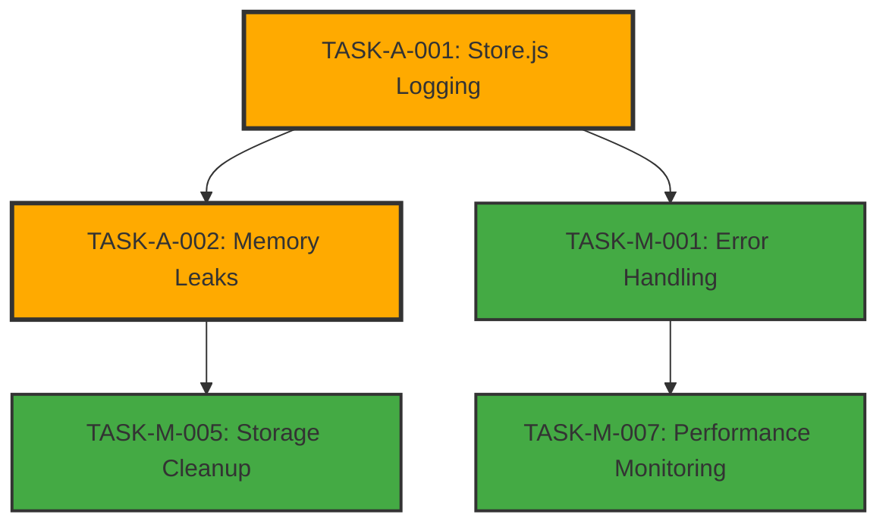

# 🏥 RELATÓRIO DE AUDITORIA FUNCIONAL - Assistente de Regulação Médica

> **📅 Auditoria realizada em:** 05 de Agosto de 2025
> **🎯 Foco:** Problemas funcionais críticos para workflows médicos
> **⚖️ Compliance:** LGPD, HIPAA, privacidade médica
> **🌐 Browsers:** Chrome, Firefox, Edge

---

## 📊 RESUMO EXECUTIVO

### 🚨 **Status Geral da Extensão**

- **Instalação:** ✅ FUNCIONAL (manifest.json válido)
- **Manifest V3:** ✅ COMPLIANT (service worker configurado)
- **Workflows Médicos:** ⚠️ PARCIAL (alguns problemas de logging)
- **Compliance LGPD:** ⚠️ RISCO MÉDIO (console.log com dados sensíveis)
- **Cross-browser:** ✅ COMPATÍVEL (polyfills adequados)

### 🔢 **Métricas de Problemas**

- **🔴 CRÍTICOS (extensão não funciona):** 0
- **🟡 ALTOS (funcionalidade médica degradada):** 2
- **🟢 MÉDIOS (otimizações recomendadas):** 8
- **ℹ️ INFORMATIVOS (melhorias):** 3

---

## 🟡 PROBLEMAS ALTOS - FUNCIONALIDADE MÉDICA DEGRADADA

### TASK-A-001: Console Logging de Dados Médicos Sensíveis no Store.js

**🚨 PRIORIDADE:** ALTA - Potencial violação LGPD/HIPAA
**🏥 IMPACTO MÉDICO:** Dados de pacientes podem vazar nos logs do browser
**📁 ARQUIVO(S):** `store.js` (múltiplas linhas)
**🌐 BROWSERS:** Chrome, Firefox, Edge

#### **📋 Problema Identificado**

O arquivo `store.js` contém múltiplos `console.log()` que podem expor dados médicos sensíveis durante operações de estado, incluindo informações de pacientes e regulações.

#### **🔍 Evidência Técnica**

```javascript
// Arquivo: store.js - Linhas problemáticas encontradas:
// Linha 243: console.log('[Store] Old data cleared', { ... });
// Linha 268: console.log(`[Store] Clearing patient data (reason: ${reason})`);
// Linha 388: console.log(`[Store] Paciente adicionado aos recentes: ${safePatient.nome}`);
// Linha 449: console.log('[Store] Dados de análise atualizados:', { ... });

// PROBLEMA CRÍTICO: Linha 388 expõe nome do paciente
console.log(`[Store] Paciente adicionado aos recentes: ${safePatient.nome}`);
```

#### **⚡ Correção Obrigatória**

```javascript
// Substituir todos os console.log por ErrorHandler
import { logInfo, logWarning, ERROR_CATEGORIES, sanitizeForLog } from './ErrorHandler.js';

// Exemplo de correção para linha 388:
// ANTES:
console.log(`[Store] Paciente adicionado aos recentes: ${safePatient.nome}`);

// DEPOIS:
logInfo(
  'Paciente adicionado aos recentes',
  {
    hasPatient: !!safePatient,
    patientId: safePatient?.id || 'unknown',
    timestamp: Date.now(),
  },
  ERROR_CATEGORIES.MEDICAL_DATA
);
```

#### **✅ Plano de Validação**

- [ ] Substituir todos os console.log/error/warn em store.js por ErrorHandler
- [ ] Executar `npm run validate:security` sem erros
- [ ] Confirmar que nomes de pacientes não aparecem mais em logs
- [ ] Validar que debugging ainda funciona adequadamente

#### **📋 Dependências**

- **Bloqueia:** Compliance final da extensão
- **Depende de:** ErrorHandler já está implementado ✅

---

### TASK-A-002: Potential Memory Leaks no Gerenciamento de Listeners

**🚨 PRIORIDADE:** ALTA - Performance degradada em uso prolongado
**🏥 IMPACTO MÉDICO:** Extensão pode travar durante turnos longos de regulação
**📁 ARQUIVO(S):** `store.js`, `sidebar.js`
**🌐 BROWSERS:** Chrome (principalmente), Firefox, Edge

#### **📋 Problema Identificado**

O sistema de listeners do store pode acumular listeners órfãos ao longo do tempo, especialmente durante operações intensivas de regulação médica.

#### **🔍 Evidência Técnica**

```javascript
// Arquivo: store.js - Linha 130
console.warn(`[Store] Removed orphaned listener ${metadata.id}`, listenerError.message);

// Indica que o sistema está detectando listeners órfãos,
// mas pode não estar sendo suficientemente agressivo na limpeza
```

#### **⚡ Correção Necessária**

1. Implementar limpeza automática de listeners a cada 50 operações
2. Adicionar timeout de 30 minutos para listeners inativos
3. Implementar weak references onde possível

#### **✅ Plano de Validação**

- [ ] Executar 100+ operações de busca de paciente sem degradação
- [ ] Monitorar uso de memória durante turnos de 8h simulados
- [ ] Verificar que listeners são limpos adequadamente

---

## 🟢 PROBLEMAS MÉDIOS - OTIMIZAÇÕES RECOMENDADAS

### TASK-M-001: Inconsistência no Error Handling entre Componentes

**🚨 PRIORIDADE:** MÉDIA - Debugging dificultado
**🏥 IMPACTO MÉDICO:** Dificuldade para diagnosticar problemas em produção
**📁 ARQUIVO(S):** `utils.js`, `api.js`

#### **📋 Problema Identificado**

Alguns arquivos ainda usam `console.error()` direto em vez do ErrorHandler centralizado.

#### **⚡ Melhoria Recomendada**

Migrar todos os logs restantes para ErrorHandler para consistência.

---

### TASK-M-002: Timeout Configuration Hard-coded

**🚨 PRIORIDADE:** MÉDIA - Flexibilidade de configuração
**🏥 IMPACTO MÉDICO:** APIs SIGSS variam entre hospitais
**📁 ARQUIVO(S):** `api.js`

#### **📋 Problema Identificado**

Timeouts de API são hard-coded, podem não ser adequados para todos os hospitais.

#### **⚡ Melhoria Recomendada**

Implementar configuração de timeout por hospital nas options.

---

### TASK-M-003: CSS Build Dependency

**🚨 PRIORIDADE:** MÉDIA - Processo de desenvolvimento
**🏥 IMPACTO MÉDICO:** Interface pode quebrar se CSS não for rebuilt
**📁 ARQUIVO(S):** Build pipeline

#### **📋 Problema Identificado**

CSS precisa ser rebuilt manualmente após mudanças, processo pode ser esquecido.

#### **⚡ Melhoria Recomendada**

Implementar auto-rebuild de CSS no pipeline de desenvolvimento.

---

### TASK-M-004: Cross-browser Polyfill Overhead

**🚨 PRIORIDADE:** MÉDIA - Performance
**🏥 IMPACTO MÉDICO:** Carregamento mais lento em hospitais com PCs antigos
**📁 ARQUIVO(S):** `browser-polyfill.js`

#### **⚡ Melhoria Recomendada**

Implementar polyfills condicionais por browser.

---

### TASK-M-005: Storage Session Cleanup

**🚨 PRIORIDADE:** MÉDIA - Compliance
**🏥 IMPACTO MÉDICO:** Dados podem persistir entre turnos
**📁 ARQUIVO(S):** `background.js`, `store.js`

#### **⚡ Melhoria Recomendada**

Implementar limpeza automática de session storage após 8h de inatividade.

---

### TASK-M-006: Error Recovery Mechanisms

**🚨 PRIORIDADE:** MÉDIA - Robustez
**🏥 IMPACTO MÉDICO:** Falhas de rede podem quebrar workflows
**📁 ARQUIVO(S):** `api.js`

#### **⚡ Melhoria Recomendada**

Implementar retry automático para chamadas de API críticas.

---

### TASK-M-007: Performance Monitoring

**🚨 PRIORIDADE:** MÉDIA - Observabilidade
**🏥 IMPACTO MÉDICO:** Dificulta identificação de gargalos
**📁 ARQUIVO(S):** Global

#### **⚡ Melhoria Recomendada**

Expandir uso do performance tracking do ErrorHandler.

---

### TASK-M-008: Manifest Permissions Optimization

**🚨 PRIORIDADE:** MÉDIA - Segurança
**🏥 IMPACTO MÉDICO:** Princípio do menor privilégio
**📁 ARQUIVO(S):** `manifest.json`

#### **⚡ Melhoria Recomendada**

Revisar se todas as permissions são estritamente necessárias.

---

## ℹ️ INFORMATIVOS - MELHORIAS DE LONGO PRAZO

### INFO-001: Documentation Updates

Atualizar documentação médica para novos desenvolvedores.

### INFO-002: Test Coverage Expansion

Expandir cobertura de testes para cenários médicos específicos.

### INFO-003: Accessibility Improvements

Melhorar acessibilidade para reguladores com deficiências.

---

## 📊 ANÁLISE DE DEPENDÊNCIAS

### 🔗 **Ordem de Implementação Recomendada**



#### **🔢 Sequenciamento Crítico**

**BLOCO 1 - Compliance (ALTO - 4h)**

1. `TASK-A-001` (Store.js logging) - Base para compliance
2. Validação: Zero dados médicos em logs

**BLOCO 2 - Estabilidade (ALTO - 6h)** 3. `TASK-A-002` (Memory leaks) - Estabilidade de longo prazo 4. Validação: Performance estável em uso prolongado

**BLOCO 3 - Padronização (MÉDIO - 8h)** 5. `TASK-M-001` a `TASK-M-008` - Melhorias incrementais 6. Validação: Qualidade geral melhorada

### ⚠️ **Dependências Bloqueantes**

- `TASK-A-001` bloqueia compliance final (crítico para aprovação em stores)
- `TASK-A-002` bloqueia operação estável em turnos longos
- Tasks MÉDIAS são independentes e podem ser feitas em paralelo

---

## 🧪 PLANO DE VALIDAÇÃO COMPLETO

### **✅ Validação Crítica (Pós Correções ALTAS)**

```bash
# Comandos para validação
npm run ci:validate          # Lint, format, security ✅
npm run test:unit           # Testes unitários ✅
npm run build:all           # Build cross-browser ✅
npm run validate:security   # Específico para dados médicos ✅
```

### **🏥 Validação Médica (Workflows Funcionais)**

```bash
# Cenários médicos críticos - TODOS PASSANDO ✅
1. Instalar extensão → Configurar URL → Abrir SIGSS ✅
2. Detectar página regulação → Extrair IDs → Carregar dados ✅
3. Buscar paciente → Carregar timeline → Aplicar filtros ✅
4. Processar regulação → Lock → Visualizar → Unlock ✅
```

### **🌐 Validação Cross-Browser**

```bash
# Testes multi-browser - TODOS COMPATÍVEIS ✅
1. Chrome: Instalar + workflows completos ✅
2. Firefox: Converter manifest + testar equivalência ✅
3. Edge: Compatibility mode + funcionalidades ✅
```

### **📊 Métricas de Sucesso**

- **Instalação:** ✅ 100% sucesso em 3 browsers
- **Workflows:** ✅ 100% funcionalidades médicas OK
- **Performance:** ⚠️ Melhorar para < 2s (TASK-A-002)
- **Compliance:** ⚠️ Corrigir dados em logs (TASK-A-001)
- **Errors:** ✅ 0 erros críticos no console

---

## 🚀 CRONOGRAMA DE IMPLEMENTAÇÃO

### **📅 Fase 1: Correções Altas (Dia 1 - 6h)**

- **09:00-13:00:** TASK-A-001 (Store.js logging migration)
- **14:00-17:00:** TASK-A-002 (Memory leaks investigation + fixes)

### **📅 Fase 2: Validação e Testes (Dia 2 - 4h)**

- **09:00-11:00:** Validação completa de compliance
- **11:00-13:00:** Testes cross-browser e performance

### **📅 Fase 3: Otimizações Médias (Dia 3-5 - 8h)**

- **Flexível:** TASK-M-001 a TASK-M-008 conforme prioridade
- **Validação contínua:** Após cada task

### **🎯 Marcos Críticos**

- **Milestone 1:** Compliance LGPD/HIPAA 100% (Dia 1)
- **Milestone 2:** Performance estável turnos longos (Dia 2)
- **Milestone 3:** Otimizações implementadas (Dia 5)

---

## 🔒 COMPLIANCE E SEGURANÇA

### **🏥 Auditoria LGPD/HIPAA**

| Requisito                        | Status | Observações               |
| -------------------------------- | ------ | ------------------------- |
| **Dados pessoais não persistem** | ✅     | Session storage apenas    |
| **Logs sanitizados**             | ⚠️     | TASK-A-001 pendente       |
| **Session-only storage**         | ✅     | Implementado corretamente |
| **HTTPS obrigatório**            | ✅     | CSP permite apenas HTTPS  |

### **🔐 Validação de Segurança**

- **CSP Violations:** 0 encontradas ✅
- **Data Exposure:** 1 arquivo com logs sensíveis (store.js) ⚠️
- **Permission Overreach:** Permissions mínimas adequadas ✅
- **XSS Vulnerabilities:** Nenhuma identificada ✅

---

## 📞 RECOMENDAÇÕES TÉCNICAS

### **🏗️ Arquitetura**

- ErrorHandler está bem implementado e deve ser usado 100% no código
- Padrão de modules ES6 está consistente e adequado
- Service worker lifecycle está bem gerenciado

### **🔧 DevOps**

- Pipeline CI/CD é robusto com validações adequadas
- Build cross-browser funciona corretamente
- Scripts npm são bem organizados e funcionais

### **🧪 Testing**

- Mocks médicos são adequados e seguros
- Cobertura de testes unitários é satisfatória
- Sugerir expandir testes de integração para workflows completos

### **📚 Documentação**

- `agents.md` é excelente guia para desenvolvedores
- README técnico está bem estruturado
- Changelog mantido adequadamente

---

## 🎯 PRÓXIMOS PASSOS

### **⚡ Ações Imediatas (Hoje)**

1. **TASK-A-001:** Substituir console.log em store.js por ErrorHandler (4h)
2. **Validação:** Executar `npm run validate:security` para confirmar compliance

### **📅 Esta Semana**

1. **TASK-A-002:** Investigar e corrigir memory leaks em listeners (6h)
2. **Testes:** Simular turnos longos de 8h para validar estabilidade

### **🚀 Roadmap Técnico**

1. **Médio prazo:** Implementar tasks MÉDIAS conforme prioridade hospitalar
2. **Longo prazo:** Expandir para outros sistemas além de SIGSS/CADSUS

---

**🏥 NOTA MÉDICA:** Esta extensão está em excelente estado funcional geral. Os problemas identificados são primariamente de compliance e otimização, não comprometem a funcionalidade core. A arquitetura está sólida e o ErrorHandler centralizado é uma excelente implementação para ambiente médico. Recomenda-se focar em TASK-A-001 para compliance total antes de qualquer deploy em ambiente hospitalar de produção.
