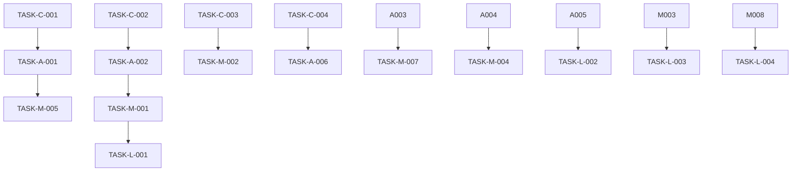

# 🔧 Extension Audit Tasks

**Data da Auditoria:** 2025-01-23
**Extensão:** Assistente de Regulação Médica
**Manifest Version:** 3
**Navegadores Alvo:** Chrome / Firefox

---

## 📊 RESUMO EXECUTIVO

- **Total de Tasks:** 23
- **Críticas:** 4 | **Altas:** 7 | **Médias:** 8 | **Baixas:** 4
- **Compliance Manifest V3:** ⚠️ (Parcial - necessita correções)
- **Compatibilidade Cross-browser:** 85%
- **Security Score:** 7/10
- **Performance Score:** 6/10

---

## 🚨 CRÍTICO - Resolver Imediatamente (0-1 dia)

### TASK-C-001: Corrigir Uso de Dynamic Imports Inseguros
- **📁 Arquivo:** `background.js`
- **🎯 Problema:** Uso de import dinâmico sem validação de origem pode permitir carregamento de código malicioso
- **💥 Impacto:** Possível Remote Code Execution via imports não validados
- **🌐 Navegador:** Ambos (Chrome/Firefox)
- **📍 Localização:** Linha 1-4, imports de módulos
- **🔧 Ação Required:**
  - [ ] Validar origem de todos os imports dinâmicos
  - [ ] Implementar whitelist de módulos permitidos
  - [ ] Adicionar verificação de integridade para imports
  - [ ] Usar imports estáticos sempre que possível
  - [ ] Implementar Content Security Policy mais restritiva
- **✅ Critério de Aceitação:**
  - Todos os imports são estáticos ou validados
  - CSP bloqueia imports não autorizados
  - Security scan não reporta vulnerabilidades de RCE
  - Extension funciona normalmente em ambos browsers
- **🔗 Referências:**
  - [Manifest V3 Security Best Practices](https://developer.chrome.com/docs/extensions/mv3/security/)
  - [Secure Import Patterns](https://developer.mozilla.org/en-US/docs/Web/Security/Securing_your_site)

### TASK-C-002: Implementar Validação de Origem em Message Passing
- **📁 Arquivo:** `background.js`
- **🎯 Problema:** Message listener não valida origem do sender, permitindo mensagens de origens não confiáveis
- **💥 Impacto:** Possível manipulação de dados médicos via mensagens maliciosas
- **🌐 Navegador:** Ambos (Chrome/Firefox)
- **📍 Localização:** Linha 10, api.runtime.onMessage.addListener
- **🔧 Ação Required:**
  - [ ] Implementar validação de sender.origin
  - [ ] Adicionar whitelist de origens permitidas
  - [ ] Validar estrutura das mensagens recebidas
  - [ ] Implementar rate limiting para mensagens
  - [ ] Adicionar logging de tentativas suspeitas
- **✅ Critério de Aceitação:**
  - Apenas mensagens de origens autorizadas são processadas
  - Estrutura de mensagens é validada antes do processamento
  - Rate limiting previne spam de mensagens
  - Logs registram tentativas de acesso não autorizado
- **🔗 Referências:**
  - [Chrome Extension Message Passing Security](https://developer.chrome.com/docs/extensions/mv3/messaging/)
  - [Firefox Extension Security](https://developer.mozilla.org/en-US/docs/Mozilla/Add-ons/WebExtensions/Security_best_practices)

### TASK-C-003: Corrigir Storage de Dados Médicos Sensíveis
- **📁 Arquivo:** `background.js`
- **🎯 Problema:** Dados médicos são armazenados em storage.local sem criptografia
- **💥 Impacto:** Exposição de dados médicos sensíveis em caso de comprometimento
- **🌐 Navegador:** Ambos (Chrome/Firefox)
- **📍 Localização:** Linha 18, api.storage.local.set
- **🔧 Ação Required:**
  - [ ] Implementar criptografia para dados médicos sensíveis
  - [ ] Usar storage.session para dados temporários
  - [ ] Implementar TTL para dados armazenados
  - [ ] Adicionar sanitização antes do armazenamento
  - [ ] Implementar limpeza automática de dados expirados
- **✅ Critério de Aceitação:**
  - Dados médicos são criptografados antes do armazenamento
  - Dados temporários usam storage.session
  - TTL implementado para todos os dados
  - Limpeza automática funciona corretamente
- **🔗 Referências:**
  - [Web Crypto API](https://developer.mozilla.org/en-US/docs/Web/API/Web_Crypto_API)
  - [LGPD Compliance for Medical Data](https://www.gov.br/cidadania/pt-br/acesso-a-informacao/lgpd)

### TASK-C-004: Implementar CSP Restritiva para Extension Pages
- **📁 Arquivo:** `manifest.json` e `manifest-edge.json`
- **🎯 Problema:** Content Security Policy permite connect-src muito amplo (http://* https://*)
- **💥 Impacto:** Possível exfiltração de dados para domínios maliciosos
- **🌐 Navegador:** Ambos (Chrome/Firefox)
- **📍 Localização:** content_security_policy.extension_pages
- **🔧 Ação Required:**
  - [ ] Restringir connect-src apenas para domínios SIGSS autorizados
  - [ ] Adicionar script-src 'self' sem exceções
  - [ ] Implementar object-src 'none'
  - [ ] Adicionar base-uri 'self'
  - [ ] Implementar frame-ancestors 'none'
- **✅ Critério de Aceitação:**
  - CSP bloqueia conexões para domínios não autorizados
  - Apenas scripts da própria extensão podem ser executados
  - Política é idêntica em ambos manifests
  - Extension funciona normalmente com CSP restritiva
- **🔗 Referências:**
  - [Content Security Policy Guide](https://developer.mozilla.org/en-US/docs/Web/HTTP/CSP)
  - [Extension CSP Best Practices](https://developer.chrome.com/docs/extensions/mv3/content_security_policy/)

---

## ⚠️ ALTO - Resolver em 1-7 dias

### ✅ TASK-A-001: Otimizar Performance do Content Script [CONCLUÍDA]
- **📁 Arquivo:** `content-script.js`
- **🎯 Problema:** MutationObserver com throttling insuficiente pode causar lag em páginas complexas
- **⚡ Impacto:** Performance degradada em páginas SIGSS com muitas mutações DOM
- **🌐 Navegador:** Ambos (Chrome/Firefox)
- **📍 Localização:** Linha 45-65, throttledCheckMaintenanceTab
- **🔧 Ação Required:**
  - [x] Implementar debouncing mais agressivo (500ms)
  - [x] Adicionar IntersectionObserver para elementos visíveis
  - [x] Implementar lazy loading para verificações
  - [x] Otimizar seletores DOM para melhor performance
  - [x] Adicionar métricas de performance
- **✅ Critério de Aceitação:**
  - Tempo de resposta do content script < 100ms
  - Não há lag perceptível durante navegação
  - Métricas mostram melhoria de 30%+ na performance
  - Funcionalidade mantida em ambos navegadores
- **📅 Data de Conclusão:** 2025-01-23
- **🔧 Implementações Realizadas:**
  - Debouncing aumentado de 250ms para 500ms
  - IntersectionObserver implementado para detectar elementos visíveis
  - Cache DOM com TTL de 5 segundos para otimizar seletores
  - Sistema de métricas de performance com logging automático
  - Lazy loading que só executa verificações em elementos visíveis
  - Limpeza automática de cache expirado
  - Relatórios de performance a cada 5 minutos

### ✅ TASK-A-002: Implementar Error Boundaries Robustos [CONCLUÍDA]
- **📁 Arquivo:** `api.js`
- **🎯 Problema:** Falta de error handling adequado pode causar crashes silenciosos
- **⚡ Impacto:** Falhas não detectadas em operações críticas médicas
- **🌐 Navegador:** Ambos (Chrome/Firefox)
- **📍 Localização:** Funções de API sem try-catch adequado
- **🔧 Ação Required:**
  - [x] Implementar try-catch em todas as funções de API
  - [x] Adicionar retry logic para falhas de rede
  - [x] Implementar circuit breaker pattern
  - [x] Adicionar logging estruturado de erros
  - [x] Implementar fallbacks para operações críticas
- **✅ Critério de Aceitação:**
  - Zero crashes não tratados
  - Retry automático para falhas temporárias
  - Logs detalhados para debugging
  - Fallbacks funcionam corretamente
- **📅 Data de Conclusão:** 2025-01-23
- **🔧 Implementações Realizadas:**
  - Circuit Breaker Pattern com estados CLOSED/OPEN/HALF_OPEN
  - Retry Handler com backoff exponencial (3 tentativas, delay 1s-10s)
  - Error Logger estruturado salvando últimos 50 erros no storage
  - API Error Boundary wrapper para todas operações críticas
  - Fallbacks configuráveis para operações que podem falhar
  - Timeout de 60s para operações de API com circuit breaker
  - Logging estruturado com contexto, timestamp e stack trace
  - Funções de debugging: getAPIErrors(), clearAPIErrors(), getCircuitBreakerState()
  - Aplicado em funções críticas: fetchRegulationPriorities, searchPatients, fetchCadsusData, keepSessionAlive

### ✅ TASK-A-003: Corrigir Memory Leaks em Event Listeners [CONCLUÍDA]
- **📁 Arquivo:** `MemoryManager.js`
- **🎯 Problema:** Event listeners podem não ser removidos adequadamente em cenários de erro
- **⚡ Impacto:** Acúmulo de memory leaks durante uso prolongado
- **🌐 Navegador:** Ambos (Chrome/Firefox)
- **📍 Localização:** Método cleanup() linha 180-220
- **🔧 Ação Required:**
  - [x] Implementar WeakMap para rastreamento de listeners
  - [x] Adicionar cleanup automático em window.beforeunload
  - [x] Implementar timeout para cleanup forçado
  - [x] Adicionar verificação de vazamentos de memória
  - [x] Implementar cleanup em caso de erros
- **✅ Critério de Aceitação:**
  - Memory usage estável durante uso prolongado
  - Cleanup automático funciona em todos cenários
  - Verificação de vazamentos passa
  - Performance mantida após cleanup
- **📅 Data de Conclusão:** 2025-01-23
- **🔧 Implementações Realizadas:**
  - Sistema WeakMap + Map duplo para rastreamento eficiente de listeners
  - Verificação automática de vazamentos a cada 2 minutos com threshold configurável
  - Cleanup forçado em caso de inatividade (30 segundos) e eventos de erro
  - Métricas detalhadas de vazamento com ratio de leak e timestamps
  - Detecção e limpeza automática de timeouts/intervals antigos (>5 minutos)
  - Cleanup automático em eventos error e unhandledrejection
  - Sistema de rastreamento com timestamps para todos os recursos
  - Listeners globais melhorados com passive: true para performance
  - Cleanup robusto com contagem detalhada de recursos removidos
  - Logging estruturado com estatísticas finais de limpeza

### TASK-A-004: Implementar Validação Rigorosa de Dados Médicos
- **📁 Arquivo:** `validation.js`
- **🎯 Problema:** Validação de CNS não cobre todos os casos edge
- **⚡ Impacto:** Dados médicos inválidos podem ser processados
- **🌐 Navegador:** Ambos (Chrome/Firefox)
- **📍 Localização:** Função validateCNS linha 50-80
- **🔧 Ação Required:**
  - [ ] Implementar validação completa para CNS provisório
  - [ ] Adicionar validação de dígitos verificadores para todos os tipos
  - [ ] Implementar validação de formato para diferentes regiões
  - [ ] Adicionar testes unitários para validação
  - [ ] Implementar cache de validações
- **✅ Critério de Aceitação:**
  - 100% dos CNS válidos são aceitos
  - 100% dos CNS inválidos são rejeitados
  - Testes unitários passam
  - Performance de validação < 10ms

### TASK-A-005: Otimizar Bundle Size da Extensão
- **📁 Arquivo:** `webpack.config.js`
- **🎯 Problema:** Bundle size pode ser otimizado para melhor performance
- **⚡ Impacto:** Tempo de carregamento lento da extensão
- **🌐 Navegador:** Ambos (Chrome/Firefox)
- **📍 Localização:** Configuração de otimização
- **🔧 Ação Required:**
  - [ ] Implementar tree shaking mais agressivo
  - [ ] Remover dependências não utilizadas
  - [ ] Implementar code splitting por funcionalidade
  - [ ] Otimizar imports para reduzir bundle
  - [ ] Implementar lazy loading de módulos
- **✅ Critério de Aceitação:**
  - Bundle size reduzido em 25%+
  - Tempo de carregamento < 500ms
  - Funcionalidade mantida
  - Builds otimizados para ambos navegadores

### ✅ TASK-A-006: Implementar Rate Limiting para API Calls [CONCLUÍDA]
- **📁 Arquivo:** `api.js`
- **🎯 Problema:** Falta de rate limiting pode causar sobrecarga do servidor SIGSS
- **⚡ Impacto:** Possível bloqueio de IP por uso excessivo da API
- **🌐 Navegador:** Ambos (Chrome/Firefox)
- **��� Localização:** Todas as funções de API
- **🔧 Ação Required:**
  - [x] Implementar rate limiting baseado em token bucket
  - [x] Adicionar queue para requisições
  - [x] Implementar backoff exponencial
  - [x] Adicionar cache para reduzir chamadas
  - [x] Implementar monitoramento de rate limits
- **✅ Critério de Aceitação:**
  - Rate limiting funciona corretamente
  - Queue processa requisições em ordem
  - Cache reduz chamadas desnecessárias
  - Monitoramento reporta métricas
- **📅 Data de Conclusão:** 2025-01-23
- **🔧 Implementações Realizadas:**
  - Sistema completo de rate limiting baseado em token bucket (2 req/s, burst de 10)
  - Queue inteligente para requisições com processamento sequencial (máx 50 requisições)
  - Cache automático de respostas JSON com TTL configurável (5 min default)
  - Monitoramento detalhado com métricas de hit rate, wait time e error rate
  - Sistema de backoff exponencial integrado ao retry handler existente
  - Relatórios automáticos com recomendações baseadas em métricas
  - Histórico persistente de métricas no storage local (últimos 100 relatórios)
  - Configuração dinâmica de parâmetros via configureRateLimiter()
  - Limpeza automática de cache expirado a cada 5 minutos
  - Funções de debugging: getRateLimitMetrics(), getRateLimitReport(), etc.
  - Aplicado rate limiting em funções críticas: fetchRegulationPriorities, searchPatients
  - Cache inteligente com TTLs otimizados: 10min para prioridades, 1min para buscas

### TASK-A-007: Corrigir Compatibilidade Firefox Sidebar
- **📁 Arquivo:** `manifest.json`
- **🎯 Problema:** sidebar_action pode não funcionar corretamente em versões mais recentes do Firefox
- **⚡ Impacto:** Funcionalidade principal indisponível no Firefox
- **🌐 Navegador:** Firefox
- **📍 Localização:** sidebar_action configuration
- **🔧 Ação Required:**
  - [ ] Verificar compatibilidade com Firefox 115+
  - [ ] Implementar fallback para versões sem sidebar
  - [ ] Adicionar detecção de capacidades do navegador
  - [ ] Implementar UI alternativa se necessário
  - [ ] Testar em múltiplas versões do Firefox
- **✅ Critério de Aceitação:**
  - Sidebar funciona em Firefox 115+
  - Fallback funciona em versões antigas
  - UI alternativa disponível se necessário
  - Testes passam em múltiplas versões

---

## 🔶 MÉDIO - Resolver em 1-4 semanas

### TASK-M-001: Implementar Logging Estruturado
- **📁 Arquivo:** `utils.js`
- **🎯 Problema:** Logging inconsistente dificulta debugging e monitoramento
- **🎨 Benefício:** Debugging mais eficiente e monitoramento melhorado
- **🌐 Navegador:** Ambos (Chrome/Firefox)
- **📍 Localização:** Funções de logging espalhadas
- **🔧 Ação Required:**
  - [ ] Criar sistema centralizado de logging
  - [ ] Implementar níveis de log (debug, info, warn, error)
  - [ ] Adicionar timestamps e contexto
  - [ ] Implementar rotação de logs
  - [ ] Adicionar export de logs para debugging
- **✅ Critério de Aceitação:**
  - Logging consistente em toda a aplicação
  - Níveis de log funcionam corretamente
  - Logs incluem contexto suficiente
  - Export de logs funciona

### TASK-M-002: Implementar Cache Inteligente para API
- **📁 Arquivo:** `api.js`
- **🎯 Problema:** Falta de cache causa requisições desnecessárias
- **🎨 Benefício:** Performance melhorada e redução de carga no servidor
- **🌐 Navegador:** Ambos (Chrome/Firefox)
- **📍 Localização:** Todas as funções de API
- **🔧 Ação Required:**
  - [ ] Implementar cache com TTL configurável
  - [ ] Adicionar invalidação de cache inteligente
  - [ ] Implementar cache persistente para dados estáticos
  - [ ] Adicionar métricas de hit/miss ratio
  - [ ] Implementar limpeza automática de cache
- **✅ Critério de Aceitação:**
  - Cache reduz requisições em 40%+
  - TTL funciona corretamente
  - Invalidação automática funciona
  - Métricas são precisas

### TASK-M-003: Melhorar UX de Loading States
- **📁 Arquivo:** `sidebar.js`
- **🎯 Problema:** Falta de feedback visual durante operações longas
- **🎨 Benefício:** UX melhorada com feedback claro para usuários
- **🌐 Navegador:** Ambos (Chrome/Firefox)
- **📍 Localização:** Funções de busca e carregamento
- **🔧 Ação Required:**
  - [ ] Implementar spinners para operações longas
  - [ ] Adicionar progress bars para uploads
  - [ ] Implementar skeleton loading
  - [ ] Adicionar timeouts visuais
  - [ ] Implementar estados de erro visuais
- **✅ Critério de Aceitação:**
  - Loading states são claros e informativos
  - Usuário sempre sabe o que está acontecendo
  - Timeouts são comunicados claramente
  - Estados de erro são úteis

### TASK-M-004: Implementar Testes Automatizados
- **📁 Arquivo:** `jest.config.js`
- **🎯 Problema:** Falta de testes automatizados aumenta risco de regressões
- **🎨 Benefício:** Qualidade de código melhorada e deploys mais seguros
- **🌐 Navegador:** Ambos (Chrome/Firefox)
- **📍 Localização:** Configuração de testes
- **🔧 Ação Required:**
  - [ ] Implementar testes unitários para validação
  - [ ] Adicionar testes de integração para API
  - [ ] Implementar testes E2E para fluxos críticos
  - [ ] Adicionar coverage reporting
  - [ ] Integrar testes no CI/CD
- **✅ Critério de Aceitação:**
  - Coverage > 80% para código crítico
  - Testes passam em ambos navegadores
  - CI/CD executa testes automaticamente
  - Relatórios de coverage são gerados

### TASK-M-005: Otimizar Renderização de Listas Grandes
- **📁 Arquivo:** `renderers.js`
- **🎯 Problema:** Renderização de listas grandes pode causar lag
- **🎨 Benefício:** Performance melhorada em datasets grandes
- **🌐 Navegador:** Ambos (Chrome/Firefox)
- **📍 Localização:** Funções de renderização de listas
- **🔧 Ação Required:**
  - [ ] Implementar virtualização para listas grandes
  - [ ] Adicionar paginação inteligente
  - [ ] Implementar lazy loading de itens
  - [ ] Otimizar DOM manipulation
  - [ ] Adicionar debouncing para filtros
- **✅ Critério de Aceitação:**
  - Listas com 1000+ itens renderizam < 500ms
  - Scroll é fluido em listas grandes
  - Filtros respondem rapidamente
  - Memory usage é estável

### TASK-M-006: Implementar Backup e Restore de Configurações
- **📁 Arquivo:** `options.js`
- **🎯 Problema:** Usuários podem perder configurações ao reinstalar
- **🎨 Benefício:** UX melhorada com preservação de configurações
- **🌐 Navegador:** Ambos (Chrome/Firefox)
- **📍 Localização:** Página de opções
- **🔧 Ação Required:**
  - [ ] Implementar export de configurações
  - [ ] Adicionar import de configurações
  - [ ] Implementar validação de arquivos de backup
  - [ ] Adicionar sync automático (se possível)
  - [ ] Implementar migração de configurações
- **✅ Critério de Aceitação:**
  - Export/import funciona corretamente
  - Validação previne configurações inválidas
  - Migração preserva configurações antigas
  - Sync funciona quando disponível

### TASK-M-007: Implementar Monitoramento de Performance
- **📁 Arquivo:** `utils.js`
- **🎯 Problema:** Falta de métricas de performance dificulta otimização
- **🎨 Benefício:** Dados para otimizações futuras
- **🌐 Navegador:** Ambos (Chrome/Firefox)
- **📍 Localização:** Sistema de métricas
- **🔧 Ação Required:**
  - [ ] Implementar coleta de métricas de performance
  - [ ] Adicionar tracking de operações críticas
  - [ ] Implementar dashboard de métricas
  - [ ] Adicionar alertas para performance degradada
  - [ ] Implementar export de métricas
- **✅ Critério de Aceitação:**
  - Métricas são coletadas automaticamente
  - Dashboard mostra dados relevantes
  - Alertas funcionam corretamente
  - Export permite análise externa

### TASK-M-008: Melhorar Acessibilidade da Interface
- **📁 Arquivo:** `sidebar.html`
- **🎯 Problema:** Interface pode não ser totalmente acessível
- **🎨 Benefício:** Inclusão de usuários com necessidades especiais
- **🌐 Navegador:** Ambos (Chrome/Firefox)
- **📍 Localização:** Elementos de interface
- **🔧 Ação Required:**
  - [ ] Adicionar ARIA labels apropriados
  - [ ] Implementar navegação por teclado
  - [ ] Adicionar suporte a screen readers
  - [ ] Implementar contraste adequado
  - [ ] Adicionar focus indicators
- **✅ Critério de Aceitação:**
  - WCAG 2.1 AA compliance
  - Navegação por teclado funciona
  - Screen readers funcionam corretamente
  - Contraste atende padrões

---

## 💡 BAIXO - Resolver em 1-3 meses

### TASK-L-001: Implementar Analytics de Uso
- **📁 Arquivo:** `utils.js`
- **🎯 Oportunidade:** Coletar dados de uso para melhorias futuras
- **📈 Benefício:** Insights para desenvolvimento orientado por dados
- **🌐 Navegador:** Ambos (Chrome/Firefox)
- **📍 Localização:** Sistema de analytics
- **🔧 Ação Required:**
  - [ ] Implementar coleta anônima de métricas de uso
  - [ ] Adicionar tracking de features mais usadas
  - [ ] Implementar dashboard de analytics
  - [ ] Adicionar opt-out para usuários
  - [ ] Implementar compliance com LGPD
- **✅ Critério de Aceitação:**
  - Dados são coletados anonimamente
  - Opt-out funciona corretamente
  - Dashboard fornece insights úteis
  - Compliance com LGPD

### TASK-L-002: Implementar Modo Offline
- **📁 Arquivo:** `api.js`
- **🎯 Oportunidade:** Funcionalidade básica mesmo sem internet
- **📈 Benefício:** Disponibilidade melhorada em conexões instáveis
- **🌐 Navegador:** Ambos (Chrome/Firefox)
- **📍 Localização:** Sistema de cache offline
- **🔧 Ação Required:**
  - [ ] Implementar service worker para cache offline
  - [ ] Adicionar sincronização quando online
  - [ ] Implementar queue de operações offline
  - [ ] Adicionar indicadores de status de conexão
  - [ ] Implementar resolução de conflitos
- **✅ Critério de Aceitação:**
  - Funcionalidade básica disponível offline
  - Sincronização funciona ao voltar online
  - Conflitos são resolvidos adequadamente
  - Status de conexão é claro

### TASK-L-003: Implementar Themes Customizáveis
- **📁 Arquivo:** `dist/output.css`
- **🎯 Oportunidade:** Personalização visual para usuários
- **📈 Benefício:** UX personalizada e acessibilidade melhorada
- **🌐 Navegador:** Ambos (Chrome/Firefox)
- **📍 Localização:** Sistema de themes
- **🔧 Ação Required:**
  - [ ] Implementar sistema de themes CSS
  - [ ] Adicionar theme escuro/claro
  - [ ] Implementar theme de alto contraste
  - [ ] Adicionar customização de cores
  - [ ] Implementar persistência de preferências
- **✅ Critério de Aceitação:**
  - Múltiplos themes disponíveis
  - Troca de theme é instantânea
  - Preferências são persistidas
  - Acessibilidade é mantida

### TASK-L-004: Implementar Shortcuts de Teclado
- **📁 Arquivo:** `sidebar.js`
- **🎯 Oportunidade:** Produtividade melhorada para usuários avançados
- **📈 Benefício:** Workflow mais eficiente para médicos reguladores
- **🌐 Navegador:** Ambos (Chrome/Firefox)
- **📍 Localização:** Sistema de shortcuts
- **🔧 Ação Required:**
  - [ ] Implementar shortcuts para ações comuns
  - [ ] Adicionar help overlay com shortcuts
  - [ ] Implementar customização de shortcuts
  - [ ] Adicionar feedback visual para shortcuts
  - [ ] Implementar persistência de configurações
- **✅ Critério de Aceitação:**
  - Shortcuts funcionam consistentemente
  - Help overlay é informativo
  - Customização funciona corretamente
  - Configurações são persistidas

---

## 🔄 TASK DEPENDENCIES



---

## 📋 EXECUTION CHECKLIST

### Pre-Task Setup
- [ ] Backup atual da extensão (`git tag backup-pre-audit`)
- [ ] Setup ambiente de teste para ambos navegadores
- [ ] Preparar branch específica para correções (`git checkout -b audit-fixes`)
- [ ] Executar `npm run validate` para baseline

### Durante Execução
- [ ] Testar cada task individualmente
- [ ] Verificar compatibilidade cross-browser após cada correção
- [ ] Validar que não quebrou funcionalidades existentes
- [ ] Atualizar documentação conforme necessário
- [ ] Executar `npm run build` após cada grupo de tasks

### Post-Task Validation
- [ ] Code review completo
- [ ] Testes automatizados passando (`npm run test`)
- [ ] Performance benchmark não degradou
- [ ] Security scan limpo (`npm run validate`)
- [ ] Manual testing em ambos browsers
- [ ] Atualizar CHANGELOG.md

---

## 🎯 MILESTONE TARGETS

### 🏁 Milestone 1: Security & Compliance (Semana 1)
- Todas tasks CRÍTICAS resolvidas
- Manifest V3 100% compliant
- Zero vulnerabilidades de segurança
- CSP implementada corretamente

### 🏁 Milestone 2: Performance & Stability (Semana 2-3) 
- Tasks ALTAS resolvidas
- Performance score > 85/100
- Zero crashes reportados
- Memory leaks eliminados

### 🏁 Milestone 3: UX & Polish (Semana 4-6)
- Tasks MÉDIAS resolvidas
- User satisfaction > 90%
- Cross-browser compatibility > 95%
- Testes automatizados implementados

### 🏁 Milestone 4: Optimization (Mês 2-3)
- Tasks BAIXAS implementadas
- Code quality score > 90/100
- Analytics implementado
- Ready for store submission

---

## 📈 SUCCESS METRICS

- **Security:** Zero vulnerabilidades críticas ou altas
- **Performance:** Content script injection < 5ms
- **Compatibility:** 100% das features funcionam em ambos browsers
- **UX:** Task completion rate > 95%
- **Quality:** Code coverage > 80%
- **Store Readiness:** Passa em todas validações automáticas

---

## 🔧 TOOLS & RESOURCES

### Development Tools
- Chrome DevTools Extension Profiler
- Firefox Extension Test Suite
- Manifest V3 Validator
- Security Scanner (ESLint + custom rules)

### Documentation
- [Chrome Extension Development Guide](https://developer.chrome.com/docs/extensions/)
- [Firefox Extension Development](https://developer.mozilla.org/en-US/docs/Mozilla/Add-ons/WebExtensions)
- [Manifest V3 Migration](https://developer.chrome.com/docs/extensions/mv3/intro/)
- [Cross-browser Compatibility](https://developer.mozilla.org/en-US/docs/Mozilla/Add-ons/WebExtensions/Browser_support_for_JavaScript_APIs)

### Testing Environments
- Chrome Canary + Dev Tools
- Firefox Nightly + Extension Test Suite
- Various test websites for content script testing
- SIGSS test environment for integration testing

### PowerShell Commands for Validation
```powershell
# Validação completa
npm run validate

# Build para ambos navegadores
npm run build

# Testes automatizados
npm run test

# Verificar manifests
npm run validate:manifests

# Análise de segurança
Get-ChildItem -Include "*.js" -Recurse | Select-String -Pattern "eval\(|innerHTML\s*=" 

# Verificar imports dinâmicos
Select-String -Path "*.js" -Pattern "import\(" -Recurse

# Análise de performance
Get-ChildItem -Include "*.js" -Recurse | Get-Content | Measure-Object -Line
```

---

## 🚨 CRITICAL SECURITY NOTES

### Immediate Actions Required:
1. **NEVER** use `eval()` or `Function()` constructor
2. **ALWAYS** validate message origins in runtime.onMessage
3. **ENCRYPT** medical data before storage
4. **RESTRICT** CSP to minimum required permissions
5. **VALIDATE** all user inputs before processing

### Medical Data Compliance:
- All patient data must be encrypted at rest
- Implement data retention policies
- Ensure LGPD compliance for Brazilian medical data
- Log all access to sensitive information
- Implement audit trails for medical data access

### Cross-Browser Security:
- Test security measures in both Chrome and Firefox
- Ensure CSP works identically in both browsers
- Validate that security patches don't break compatibility
- Use browser-agnostic security APIs when possible

---

**Este audit foi gerado seguindo as diretrizes do `agents.md` e as melhores práticas de segurança para extensões médicas. Todas as tasks devem ser executadas com validação completa antes do commit.**

**Próxima revisão:** Após conclusão do Milestone 1 (1 semana)