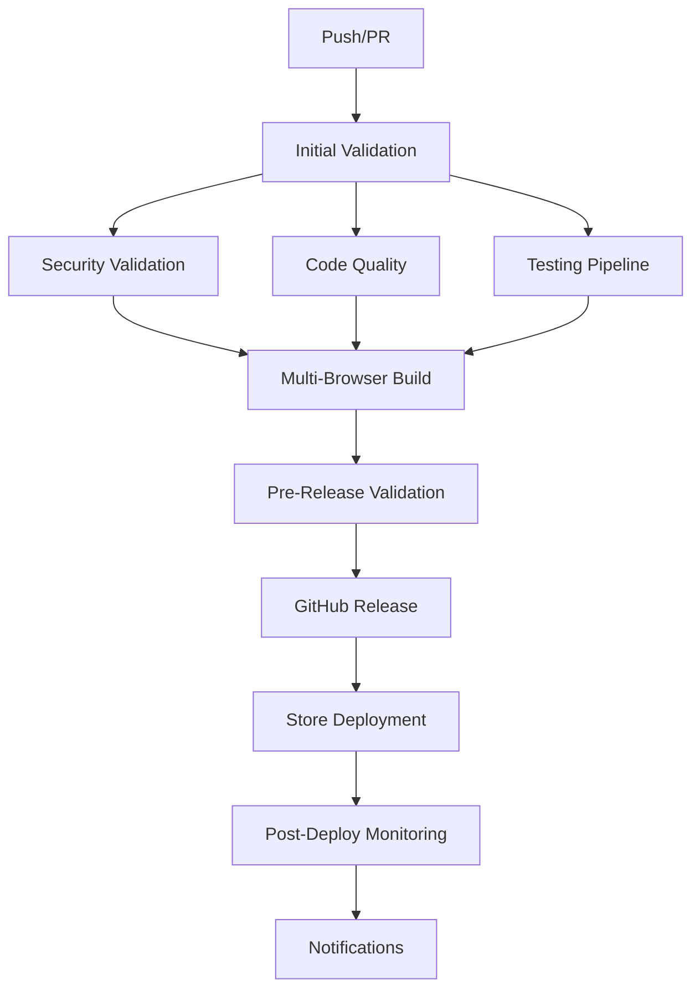

# 🚀 PIPELINE COMPLETO DE CI/CD - ASSISTENTE DE REGULAÇÃO MÉDICA

## 📋 Visão Geral

Este documento descreve o pipeline completo de CI/CD implementado para o Assistente de Regulação Médica, uma extensão de navegador que auxilia médicos reguladores na análise de solicitações médicas.

### 🎯 Objetivos do Pipeline

- **Automação Completa**: Build, teste, validação e deploy automatizados
- **Qualidade Garantida**: Validações rigorosas de código, segurança e performance
- **Multi-Browser**: Suporte nativo para Chrome, Firefox e Edge
- **Store Deployment**: Upload automatizado para Chrome Web Store, Firefox Add-ons e Edge Add-ons
- **Monitoramento**: Notificações e métricas em tempo real
- **Segurança**: Scanning de vulnerabilidades e compliance com LGPD/GDPR

---

## 🏗️ Arquitetura do Pipeline

### 📊 Fluxo Principal



### 🔄 Workflows Implementados

#### 1. **Continuous Integration** (`ci.yml`)
- **Trigger**: Push/PR para main/develop
- **Duração**: ~15-20 minutos
- **Stages**: 6 estágios paralelos e sequenciais
- **Matrix**: Chrome, Firefox, Edge em Ubuntu/Windows

#### 2. **Continuous Deployment** (`cd.yml`)
- **Trigger**: Tags `v*.*.*` ou workflow manual
- **Duração**: ~25-35 minutos
- **Stages**: 7 estágios com validação completa
- **Deploy**: Automático para stores oficiais

#### 3. **Security Scanning** (`security.yml`)
- **Trigger**: Push, PR, schedule semanal
- **Duração**: ~10-15 minutos
- **Stages**: 5 estágios de análise de segurança
- **Compliance**: LGPD/GDPR e políticas das stores

#### 4. **Performance Testing** (`performance.yml`)
- **Trigger**: Push, PR, schedule semanal
- **Duração**: ~15-20 minutos
- **Stages**: 5 estágios de análise de performance
- **Métricas**: Bundle size, Core Web Vitals, network efficiency

---

## 🔧 Configuração e Setup

### 📋 Pré-requisitos

#### Ambiente de Desenvolvimento
```bash
# Node.js 18+ e npm 8+
node --version  # >= 18.0.0
npm --version   # >= 8.0.0

# Dependências do projeto
npm ci
```

#### Secrets do GitHub
Configure os seguintes secrets no repositório:

##### Chrome Web Store
```
CHROME_EXTENSION_ID=your_extension_id
CHROME_CLIENT_ID=your_client_id
CHROME_CLIENT_SECRET=your_client_secret
CHROME_REFRESH_TOKEN=your_refresh_token
```

##### Firefox Add-ons
```
FIREFOX_JWT_ISSUER=your_jwt_issuer
FIREFOX_JWT_SECRET=your_jwt_secret
FIREFOX_ADDON_ID=your_addon_id (opcional)
```

##### Edge Add-ons
```
EDGE_CLIENT_ID=your_client_id
EDGE_CLIENT_SECRET=your_client_secret
EDGE_TENANT_ID=your_tenant_id
```

##### Notificações
```
DISCORD_WEBHOOK_URL=your_discord_webhook
SLACK_WEBHOOK_URL=your_slack_webhook
TEAMS_WEBHOOK_URL=your_teams_webhook
EMAIL_SMTP_HOST=your_smtp_host
EMAIL_FROM=your_email
```

### 🛠️ Scripts Disponíveis

#### Build e Desenvolvimento
```bash
# Desenvolvimento
npm run dev                    # CSS watch mode
npm run build                  # Build moderno (Chrome + Firefox + Edge)
npm run build:chrome           # Build apenas Chrome
npm run build:firefox          # Build apenas Firefox
npm run build:edge             # Build apenas Edge
npm run build:production       # Build otimizado para produção

# CSS
npm run build:css              # Build CSS
npm run build:css:optimized    # Build CSS otimizado
npm run build:css:watch        # CSS watch mode
```

#### Validação e Qualidade
```bash
# Validação completa
npm run validate               # Validação completa (encoding + manifests + security)
npm run validate:manifests     # Validar manifests
npm run validate:security      # Scan de segurança
npm run validate:permissions   # Audit de permissões
npm run validate:csp           # Validar Content Security Policy
npm run validate:performance   # Validar performance

# Linting
npm run lint                   # ESLint
npm run lint:fix               # ESLint com correções
npm run lint:security          # ESLint focado em segurança
```

#### Testes
```bash
# Testes
npm run test                   # Todos os testes
npm run test:unit              # Testes unitários
npm run test:integration       # Testes de integração
npm run test:e2e               # Testes end-to-end
npm run test:coverage          # Cobertura de testes
npm run test:ci                # Testes para CI
```

#### Performance
```bash
# Análise de performance
npm run size:check             # Verificar tamanho dos bundles
npm run performance:analyze    # Análise completa de performance
npm run performance:budget     # Verificar budget de performance
npm run build:analyze          # Análise de bundle com webpack
```

#### Release e Deploy
```bash
# Versionamento
npm run version:patch          # Incremento patch (1.0.0 → 1.0.1)
npm run version:minor          # Incremento minor (1.0.0 → 1.1.0)
npm run version:major          # Incremento major (1.0.0 → 2.0.0)

# Release
npm run release                # Release manual
npm run release:patch          # Release automático patch
npm run release:minor          # Release automático minor
npm run release:major          # Release automático major
npm run release:dry            # Simular release

# Upload para stores
npm run upload:chrome          # Upload para Chrome Web Store
npm run upload:firefox         # Upload para Firefox Add-ons
npm run upload:edge            # Upload para Edge Add-ons
npm run upload:all             # Upload para todas as stores
```

#### CI/CD
```bash
# Scripts para CI/CD
npm run ci:validate            # Validação completa para CI
npm run ci:test                # Testes para CI
npm run ci:build               # Build para CI
npm run ci:package             # Packaging para CI
npm run ci:deploy              # Deploy para CI

# Scripts de commit
npm run pre:commit             # Validação pré-commit
npm run validate:commit        # Validação + build
npm run safe:commit            # Validação + build + stage files
```

---

## 📊 Stages Detalhados

### 🔍 Stage 1: Initial Validation

#### Responsabilidades
- Detectar mudanças relevantes
- Extrair informações de versão
- Validar sincronização de manifests
- Configurar matriz de build

#### Validações
- ✅ Formato de versão semver
- ✅ Sincronização entre `manifest.json` e `manifest-edge.json`
- ✅ Campos obrigatórios presentes
- ✅ Estrutura JSON válida

#### Outputs
- `should-build`: Boolean indicando se deve prosseguir
- `version`: Versão extraída do package.json
- `manifest-version`: Versão dos manifests
- `matrix-browsers`: Array de navegadores para build

### 🛡️ Stage 2: Security Validation

#### Responsabilidades
- Validação de Manifest V3 compliance
- Audit de permissões
- Validação de Content Security Policy
- Scan de dependências
- Análise estática de código

#### Validações de Manifest V3
- ✅ `manifest_version: 3`
- ✅ `background.service_worker` presente
- ✅ Ausência de `background.scripts` (V2)
- ✅ Uso de `action` em vez de `browser_action`
- ✅ Formato correto de `web_accessible_resources`

#### Audit de Permissões
- ⚠️ Permissões perigosas: `tabs`, `history`, `bookmarks`, `cookies`
- ⚠️ Permissões amplas: `<all_urls>`, `*://*/*`
- ⚠️ Permissões sensíveis: `geolocation`, `camera`, `microphone`

#### Content Security Policy
- ✅ Presença de `script-src`
- ✅ `object-src 'none'`
- ❌ Ausência de `unsafe-eval`
- ❌ Ausência de `unsafe-inline`

#### Scan de Dependências
- ✅ `npm audit` com nível moderado
- ✅ Verificação de vulnerabilidades conhecidas
- ✅ Análise de licenças

### 📊 Stage 3: Code Quality

#### Responsabilidades
- ESLint analysis
- Code formatting check
- Complexity analysis
- Dead code detection
- Bundle size analysis

#### ESLint Rules
- ✅ Syntax errors
- ✅ Best practices
- ✅ Security patterns
- ✅ Browser compatibility

#### Métricas de Qualidade
- **Complexity**: Análise de complexidade ciclomática
- **Dead Code**: Detecção de código não utilizado
- **Bundle Size**: Análise de tamanho dos bundles
- **Dependencies**: Análise de dependências

### 🧪 Stage 4: Testing Pipeline

#### Responsabilidades
- Unit tests
- Integration tests
- Cross-browser compatibility
- Performance tests
- Accessibility tests

#### Tipos de Teste
- **Unit**: Jest para lógica de negócio
- **Integration**: Testes de integração entre módulos
- **E2E**: Testes end-to-end com Puppeteer/Playwright
- **Cross-browser**: Compatibilidade entre navegadores
- **Performance**: Métricas de performance
- **Accessibility**: Compliance com WCAG 2.1

### 🏗️ Stage 5: Multi-Browser Build

#### Responsabilidades
- Build para Chrome/Edge
- Build para Firefox
- Asset optimization
- Package creation
- Validation

#### Build Matrix
```yaml
strategy:
  matrix:
    browser: [chrome, firefox, edge]
    os: [ubuntu-latest, windows-latest]
    node-version: ['18.x']
```

#### Otimizações
- **Minification**: JavaScript e CSS
- **Compression**: Gzip/Brotli
- **Image Optimization**: Compressão de imagens
- **Tree Shaking**: Remoção de código morto
- **Code Splitting**: Divisão de bundles

### ✅ Stage 6: Pre-Release Validation

#### Responsabilidades
- Store policy validation
- Final security check
- Performance validation
- File integrity check

#### Store Compliance
- **Chrome Web Store**: Limites de tamanho, campos obrigatórios
- **Firefox Add-ons**: ID da extensão, versão mínima
- **Edge Add-ons**: Compatibilidade com Chromium

#### Performance Budgets
- **JavaScript**: < 500 KB
- **CSS**: < 100 KB
- **Total Package**: < 10 MB

---

## 🚀 Deployment Process

### 📦 GitHub Release

#### Processo Automático
1. **Tag Creation**: `git tag v1.2.3 && git push origin v1.2.3`
2. **Validation**: Validação completa pré-deploy
3. **Build**: Build de produção otimizado
4. **Package**: Criação de packages para stores
5. **Release**: Criação automática do GitHub Release
6. **Assets**: Upload de ZIPs como assets

#### Release Notes
- **Geração Automática**: Baseada em commits desde última tag
- **Categorização**: Features, fixes, security, outros
- **Links**: Downloads diretos e instruções de instalação

### 🏪 Store Deployment

#### Chrome Web Store
```javascript
// Processo automático
1. Obter access token via OAuth2
2. Upload do package via Chrome Web Store API
3. Publicação automática (produção) ou staging
4. Monitoramento do status de aprovação
```

#### Firefox Add-ons
```javascript
// Processo automático
1. Gerar JWT token
2. Upload via Firefox Add-ons API
3. Aguardar validação automática
4. Publicação em canal listed/unlisted
```

#### Edge Add-ons
```javascript
// Processo em desenvolvimento
1. Obter access token via Azure AD
2. Upload via Edge Add-ons API (em desenvolvimento)
3. Publicação automática
```

### 📊 Post-Deploy Monitoring

#### Métricas Coletadas
- **Deployment Time**: Tempo total de deploy
- **Success Rate**: Taxa de sucesso por store
- **Error Tracking**: Erros durante o processo
- **Performance**: Métricas de performance pós-deploy

#### Notificações
- **Discord**: Embeds ricos com status
- **Slack**: Attachments com detalhes
- **Teams**: MessageCards formatadas
- **Email**: HTML formatado
- **Webhook**: Payload customizado

---

## 🔔 Sistema de Notificações

### 📱 Providers Suportados

#### Discord
```javascript
// Webhook com embeds ricos
{
  embeds: [{
    title: "🎉 Build Successful",
    description: "Build completed successfully for version 1.2.3",
    color: 3066993,
    fields: [
      { name: "Version", value: "1.2.3", inline: true },
      { name: "Duration", value: "5m 32s", inline: true }
    ]
  }]
}
```

#### Slack
```javascript
// Attachments formatadas
{
  text: "🎉 Build Successful",
  attachments: [{
    color: "good",
    title: "Build completed successfully",
    fields: [
      { title: "Version", value: "1.2.3", short: true }
    ]
  }]
}
```

#### Microsoft Teams
```javascript
// MessageCard format
{
  "@type": "MessageCard",
  "themeColor": "00FF00",
  "summary": "Build Successful",
  "sections": [{
    "activityTitle": "🎉 Build Successful",
    "facts": [
      { "name": "Version", "value": "1.2.3" }
    ]
  }]
}
```

### 🎯 Tipos de Notificação

#### Build Events
- **buildSuccess**: Build completado com sucesso
- **buildFailure**: Build falhou com detalhes do erro

#### Deployment Events
- **deploymentSuccess**: Deploy realizado com sucesso
- **deploymentFailure**: Deploy falhou com detalhes

#### Security Events
- **securityAlert**: Alerta de segurança detectado

#### Performance Events
- **performanceAlert**: Métrica de performance excedida

#### Release Events
- **releaseNotification**: Nova versão disponível

---

## 📈 Métricas e Monitoramento

### 🎯 KPIs do Pipeline

#### Build Metrics
- **Build Success Rate**: > 95%
- **Build Duration**: < 20 minutos
- **Test Coverage**: > 80%
- **Security Score**: Zero vulnerabilidades críticas

#### Deployment Metrics
- **Deployment Success Rate**: > 99%
- **Deployment Duration**: < 30 minutos
- **Store Approval Rate**: > 95%
- **Rollback Rate**: < 1%

#### Quality Metrics
- **Code Quality Score**: A ou B
- **Bundle Size**: Dentro do budget
- **Performance Score**: > 90
- **Security Compliance**: 100%

### 📊 Dashboards

#### GitHub Actions
- **Workflow Runs**: Histórico de execuções
- **Success Rate**: Taxa de sucesso por workflow
- **Duration Trends**: Tendências de duração
- **Failure Analysis**: Análise de falhas

#### Store Metrics
- **Download Rates**: Taxa de downloads
- **User Ratings**: Avaliações dos usuários
- **Update Adoption**: Adoção de atualizações
- **Store Compliance**: Status de compliance

---

## 🛠️ Troubleshooting

### 🔧 Problemas Comuns

#### Build Failures

##### Manifest Validation Error
```bash
❌ Manifest versions not synchronized
```
**Solução**:
```bash
# Verificar versões
npm run validate:manifests

# Sincronizar manualmente
# Editar manifest.json e manifest-edge.json
# Garantir que version seja idêntica
```

##### Bundle Size Exceeded
```bash
❌ Bundle size exceeds budget: 600 KB > 500 KB
```
**Solução**:
```bash
# Analisar bundle
npm run build:analyze

# Otimizar código
npm run optimize

# Verificar tamanho
npm run size:check
```

##### Security Vulnerabilities
```bash
❌ Critical vulnerabilities found: 2
```
**Solução**:
```bash
# Scan de segurança
npm run security:scan

# Corrigir vulnerabilidades
npm run security:fix

# Validar correções
npm audit
```

#### Deployment Failures

##### Store Credentials Invalid
```bash
❌ Chrome credentials missing: CHROME_CLIENT_ID
```
**Solução**:
1. Verificar secrets no GitHub
2. Regenerar tokens se necessário
3. Testar credenciais localmente

##### Package Upload Failed
```bash
❌ Chrome package upload failed: Invalid package
```
**Solução**:
1. Verificar formato do package
2. Validar manifest compliance
3. Testar upload manual

### 🔍 Debug Mode

#### Ativar Debug
```bash
# Workflow manual com debug
# Marcar "Enable debug mode" = true

# Logs detalhados
# Verificar step "Debug Information"
```

#### Logs Úteis
```bash
# Build logs
cat build-report.json

# Upload logs
cat upload-report.json

# Validation logs
cat manifest-validation-report.json
```

---

## 🚀 Roadmap e Melhorias

### 📋 Próximas Implementações

#### Q1 2024
- [ ] **Edge Add-ons API**: Implementação completa
- [ ] **Visual Regression Testing**: Testes de regressão visual
- [ ] **Performance Budgets**: Budgets mais granulares
- [ ] **A/B Testing**: Deploy gradual com A/B testing

#### Q2 2024
- [ ] **Automated Rollback**: Rollback automático em caso de falha
- [ ] **Canary Deployments**: Deploy canário para validação
- [ ] **Real User Monitoring**: Monitoramento de usuários reais
- [ ] **Advanced Analytics**: Analytics avançadas de uso

#### Q3 2024
- [ ] **Multi-Environment**: Suporte para staging/production
- [ ] **Feature Flags**: Sistema de feature flags
- [ ] **Compliance Automation**: Automação de compliance
- [ ] **Security Scanning**: Scanning contínuo de segurança

### 🔧 Otimizações Planejadas

#### Performance
- **Parallel Builds**: Builds paralelos para múltiplos targets
- **Cache Optimization**: Otimização de cache do GitHub Actions
- **Incremental Builds**: Builds incrementais baseados em mudanças

#### Quality
- **Advanced Linting**: Rules customizadas para extensões
- **Mutation Testing**: Testes de mutação para qualidade
- **Code Coverage**: Cobertura de código mais detalhada

#### Security
- **SAST Integration**: Integração com ferramentas SAST
- **Dependency Scanning**: Scanning contínuo de dependências
- **Compliance Monitoring**: Monitoramento contínuo de compliance

---

## 📚 Recursos e Documentação

### 🔗 Links Úteis

#### Documentação Oficial
- [Chrome Extension Development](https://developer.chrome.com/docs/extensions/)
- [Firefox Extension Development](https://developer.mozilla.org/en-US/docs/Mozilla/Add-ons/WebExtensions)
- [Edge Extension Development](https://docs.microsoft.com/en-us/microsoft-edge/extensions-chromium/)

#### APIs das Stores
- [Chrome Web Store API](https://developer.chrome.com/docs/webstore/api/)
- [Firefox Add-ons API](https://addons-server.readthedocs.io/en/latest/topics/api/)
- [Edge Add-ons API](https://docs.microsoft.com/en-us/microsoft-edge/extensions-chromium/publish/api/)

#### GitHub Actions
- [GitHub Actions Documentation](https://docs.github.com/en/actions)
- [Workflow Syntax](https://docs.github.com/en/actions/using-workflows/workflow-syntax-for-github-actions)
- [Marketplace](https://github.com/marketplace?type=actions)

### 📖 Guias Específicos

#### Para Desenvolvedores
1. **Setup Local**: Como configurar ambiente de desenvolvimento
2. **Debugging**: Como debuggar a extensão
3. **Testing**: Como escrever e executar testes
4. **Contributing**: Como contribuir para o projeto

#### Para DevOps
1. **Pipeline Maintenance**: Como manter o pipeline
2. **Secret Management**: Como gerenciar secrets
3. **Monitoring**: Como monitorar o pipeline
4. **Troubleshooting**: Como resolver problemas

#### Para QA
1. **Testing Strategy**: Estratégia de testes
2. **Manual Testing**: Testes manuais necessários
3. **Regression Testing**: Testes de regressão
4. **Performance Testing**: Testes de performance

---

## 🎯 Conclusão

O pipeline implementado fornece uma solução completa e robusta para CI/CD de extensões de navegador, garantindo:

- ✅ **Qualidade**: Validações rigorosas em todas as etapas
- ✅ **Segurança**: Compliance com padrões de segurança
- ✅ **Performance**: Otimizações automáticas e monitoramento
- ✅ **Automação**: Processo completamente automatizado
- ✅ **Confiabilidade**: Retry logic e error handling
- ✅ **Observabilidade**: Métricas e notificações detalhadas

Este sistema permite que a equipe foque no desenvolvimento de funcionalidades enquanto o pipeline garante a qualidade, segurança e distribuição da extensão de forma automatizada e confiável.

---

**Última atualização**: 2025-01-23
**Versão do Pipeline**: 2.0.0
**Autor**: Sistema de CI/CD Automatizado
